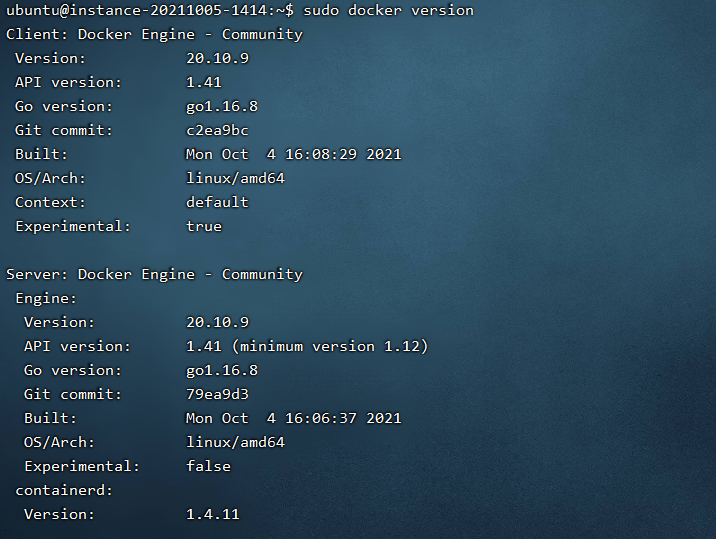

ubuntu

# 安装docker

1. 卸载原来旧的

   ```shell
    sudo apt-get remove docker docker-engine docker.io containerd runc
   ```

2. 配置所需环境

   ```shell
    sudo apt-get update
   
    sudo apt-get install \
    apt-transport-https \
    ca-certificates \
    curl \
    gnupg-agent \
    software-properties-common
   ```

3. 开始安装docker的gpg密钥

   ```shell
    阿里云gpg：curl -fsSL http://mirrors.aliyun.com/docker-ce/linux/ubuntu/gpg | sudo apt-key add -
   ```

4. 写入docker stable版本的阿里云镜像软件源

   ```shell
    sudo add-apt-repository "deb [arch=amd64] http://mirrors.aliyun.com/docker-ce/linux/ubuntu $(lsb_release -cs) stable"
   ```

5. 安装最新版的docker-ce

   ```shell
    sudo apt-get install docker-ce docker-ce-cli containerd.io
   ```

6. 阿里云加速(参考下面的地址)

   https://cr.console.aliyun.com/cn-hangzhou/instances/mirrors?accounttraceid=268c0c79f5534c71af52cfcb2e535d5fbrek

