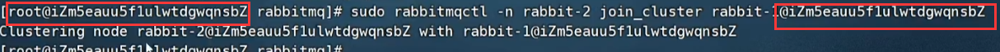

1. 正确安装rabbitmq(不启动  ps aux|grep rabbitmq 查看线程)

2. 启动第一个节点

   ```tex
   sudo RABBITMQ_NODE_PORT=5672 RABBITMQ_NODE_NAME=rabbit-1 rabbitmq-server start &
   ```

3. 启动第二节点

   ```tex
   sudo RABBITMQ_NODE_PORT=5673 RABBITMQ_SERVER_START_ARGS="-rabbitmq_management listener [{port,15673}]" RABBITMQ_NODE_NAME=rabbit-2 rabbitmq-server start &
   ```

4. 把rabbit-1做为主节点

   ```tex
   1. 停止应用
   sudo rabbitmqctl -n rabbit-1 stop_app
   2. 重置应用
   sudo rabbitmqct1 -n rabbit-1 reset
   3. 重启应用
   sudo rabbitmqctl -n rabbit-1 start_app
   ```

5. 将rabbit-2作为从节点(可以继续加)

   ```tex
   1. 停止应用
   sudo rabbitmqctl -n rabbit-2 stop_app
   2. 重置应用
   sudo rabbitmqctl -n rabbit-2 reset
   3. 将rabbit-2 加入到 rabbit-1（主节点）中【server-node 是服务器主机的名称 @hfc】
   sudo rabbitmqctl -n rabbit-2 join_cluster rabbit-1@'Server- node '
   4.启动
   sudo rabbitmqctl -n rabbit-2 start_app
   ```

   >

6. 查看集群

   ```tex
   sudo rabbitmqctl cluster status -n rabbit- 1
   ```


7. 开启web监控

   * ```tex
     rabbitmq-plugins enable rabbitmq management
     ```

   * 因为集群是重新搭载的，所以我们需要配置登录信息

     ```tex
     rabbitmqctl -n rabbit-1 add_user admin admin
     rabbitmqctl -n rabbit-1 set_ user_ tags admin administrator
     rabbitmqctl -n rabbit-1 set_ permissions -P /admin ".*" ".*" ".*"
     ```

8. 多机部署

   >如果采用多机部署方式，重读取其中一个节点的cookie,并复制到其他节点(节点之间通过cookie确定相互是否可通信)
   >
   >cookie存放在/var/lib/rabbitmq/.erlang.cookie.(隐藏文件夹)

