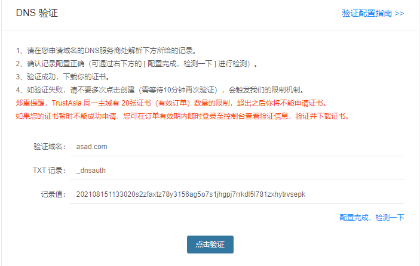

# 获取证书

通过https://freessl.cn/网站获取DNS



# 将DNS配置到域名解析


# 点击验证

# 导出证书

将解压后的证书文件 复制到服务器的/etc/ssl目录下

# 配置nginx

先监听服务的80端口，重定向到443（配置了SSL)，443端口反向代理到服务器本地的java程序(8080)

```nginx
user nginx;
worker_processes auto;
error_log /var/log/nginx/error.log;
pid /run/nginx.pid;

include /usr/share/nginx/modules/*.conf;

events {
    worker_connections 1024;
}

http {
    log_format  main  '$remote_addr - $remote_user [$time_local] "$request" '
                      '$status $body_bytes_sent "$http_referer" '
                      '"$http_user_agent" "$http_x_forwarded_for"';

    access_log  /var/log/nginx/access.log  main;

    sendfile            on;
    tcp_nopush          on;
    tcp_nodelay         on;
    keepalive_timeout   65;
    types_hash_max_size 2048;

    include             /etc/nginx/mime.types;
    default_type        application/octet-stream;

    include /etc/nginx/conf.d/*.conf;
    include /etc/nginx/vhost/*.conf;

    server {
        listen       80;
        listen       [::]:80 default_server;
        server_name  hfcplus.com;
        rewrite ^/(.*)$ https://hfcplus.com:443/$1 permanent;
        root         /usr/share/nginx/html;

        # Load configuration files for the default server block.
        include /etc/nginx/default.d/*.conf;

        location / {
             proxy_pass http://localhost:8080;
        }

        error_page 404 /404.html;
            location = /40x.html {
        }

        error_page 500 502 503 504 /50x.html;
            location = /50x.html {
        }
    }

    server{
        #监听443端口
        listen 443;
        server_name hfcplus.com;
        ssl on;
        ssl_certificate /etc/ssl/hfcplus.com_chain.crt;   #证书
        ssl_certificate_key /etc/ssl/hfcplus.com_key.key; #证书
        ssl_session_timeout 5m;
        ssl_protocols TLSv1 TLSv1.1 TLSv1.2;
        ssl_ciphers ECDHE-RSA-AES128-GCM-SHA256:HIGH:!aNULL:!MD5:!RC4:!DHE;
        ssl_prefer_server_ciphers on;
        location / {
 			proxy_pass http://localhost:8080;
        }
    }	
}
```

