#  	Scene 场景

| 方法                    | 作用                           |
| ----------------------- | ------------------------------ |
| new THREE.Scene()       | 新建场景                       |
| Scene.add()             | 添加                           |
| Scene.remove()          | 删除                           |
| Scene.children          | 获取场景中的所有对象(数组形式) |
| Scene.getObjectByName() | 通过名字获取对象               |

* 雾化

  | 方法                                            | 解释 |
  | ----------------------------------------------- | ---- |
  | scene.fog = new THREE.Fog(0xffffff, 10, 100);   |      |
  | scene.fog = new THREE.FogExp2(0xffffff, 0.015); |      |
  


# 几何体

### 1.几何体的定义

* 顶点定义

  ```javascript
  var vertices = [
  	new THREE.Vector3(0,0,5),
  	new THREE.Vector3(1,2,6),
  	new THREE.Vector3(3,6,9),
  ]
  ```

* 面定义

  ```javascript
  var faces = [
      new THREE.Face3(0,2,1),
  ]
  ```

* 定义几何体并赋值

  ```javascript
  var geom = new THREE.Geometry();
  geom.vertices = vertices;
  geom.faces = faces;
  geom.computeFaceNormals();
  ```

* 定义材质(显示线条)

  ```javascript
  var materials = [
      new THREE.MeshBasicMaterial({color: 0x000000, wireframe: true}),
      new THREE.MeshLambertMaterial({opacity: 0.6, color: 0x44ff44, transparent: true})
  ]; // 用两种材质，第一种白色显示边框，第二种绿色透明，结合起来就是绿色带线条的材质
  
  
  // 也可以使用下面的方法来创建太线条的几何体（可以设置线条的宽度）
  var wireframe = new THREE.WireFrameGeometry(geom);
  var line = new THREE.LineSegment(wireframe);
  line.material.linewidth = 20;
  secen.add(line);
  ```

* 定义网孔(网格)对象

  ```javascript
  var mesh = THREE.SceneUtils.createMultiMaterialObject(geom, materials);//创建的是对象数组
  mesh.castShadow = true;
  mesh.children.forEach(function (e) {
      e.castShadow = true
  });
  ```

* 将网孔对象添加到scene

  ```javascript
  scene.add(mesh);
  ```

### 2.几何体的属性和方法

```javascript
mesh.children.forEach(function (e) {
    e.geometry.vertices = vertices;//更新顶点
    e.geometry.verticesNeedUpdate = true;//开启顶点更新
    e.geometry.computeFaceNormals();//计算面
    delete e.geometry.__directGeometry
});

var cloneGeom = mesh.children[0].geomtry.clone();
var mesh2 = THREE.SceneUtils.createMultiMaterialObject(clonedGeometry, materials);
mesh2.translateX(5);
mesh2.translateZ(5);
mesh2.name = "clone";
scene.remove(scene.getChildByName("clone"));
```

# 网格对象

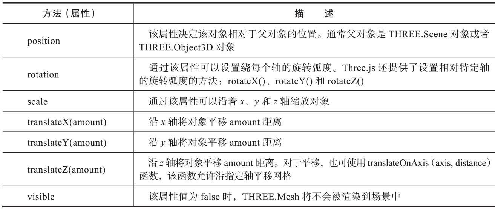

* 网格设置位置

  * ```javascript
    cube.position.x = 4;
    cube.position.y = 4;
    cube.position.z = 4;
    ```

  * ```javascript
    cube.position.set = (4,4,4);
    ```

  * ```javascript
    cube.position = new THREE.Vector3(4,4,4,);
    ```

* 网格旋转

  * ```javascript
    cube.rotation.x = 0.5 * Math.PI;
    ```

  * ```javascript
    cube.rotation.set( 0.5 * Math.PI,0,0);

  * ```javascript
    cube.rotation = new THREE.Vector3(0.5 * Math.PI,0,0);
    ```

  * ```javascript
    var xuanzhuandushu = 75;
    Var inRadians = xuanzhuandushu * (Math.PI/180);
    ```

* 缩放

  * ```javascript
    cube.scalex = 4;
    cube.scaley = 4;
    cube.scalez = 4;
    ```

  * ```javascript
    cube.scale.set = (4,4,4);
    ```

# 摄像机

### PerspectiveCamera 透视摄像机

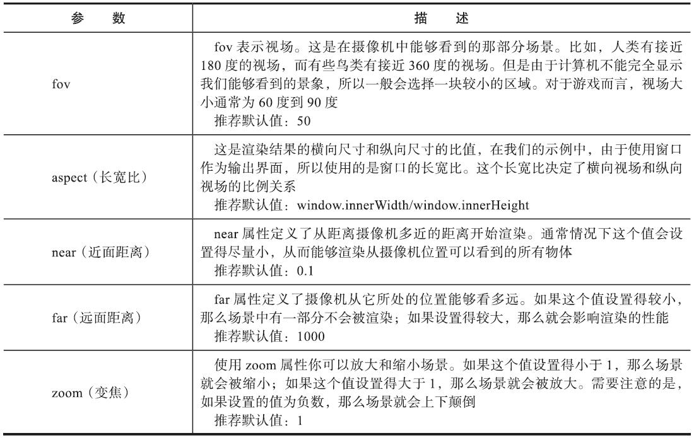

### OrthographicCamera 正交摄像机


### 摄像机属性和方法

* lookAt

  * ```javascript
    camera.lookAt(0,0,0);
    ```

  * ```javascript
    camera.lookAt(scene);
    ```

  * ```javascript
    camera.lookAt(new THREE.Vector(3,0,0));
    ```


# 光源

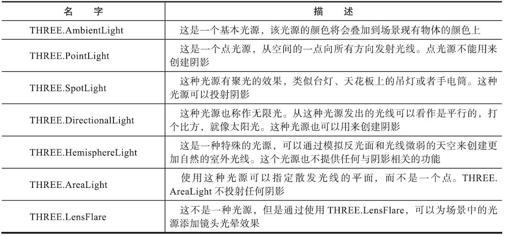

```javascript
var ambientLight = new THREE.AmbientLight("#606008", 1);//光照强度为1
```

### THREE.Color

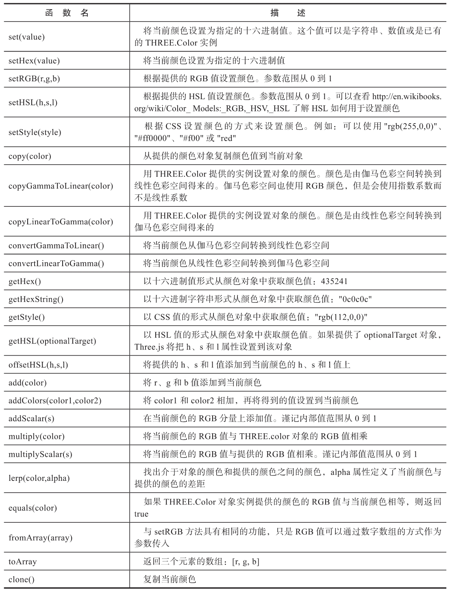

### SpotLight

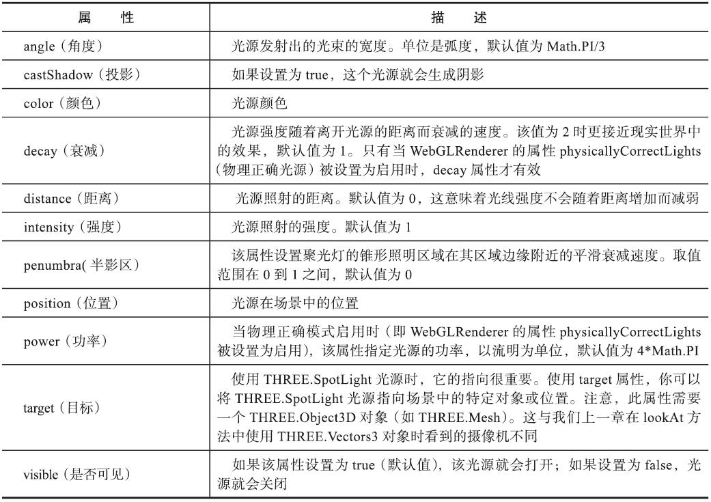

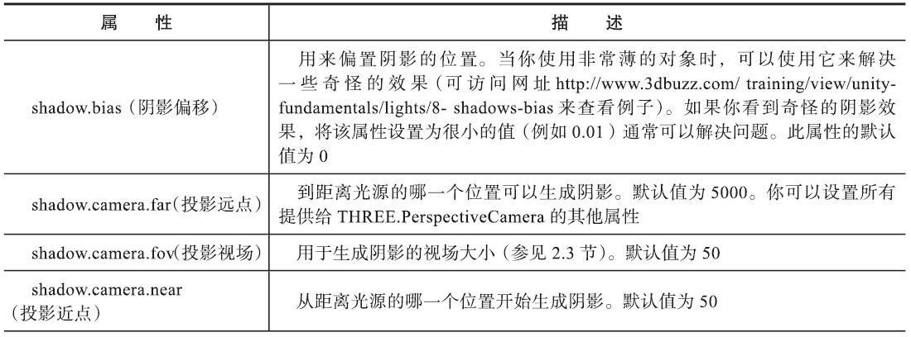

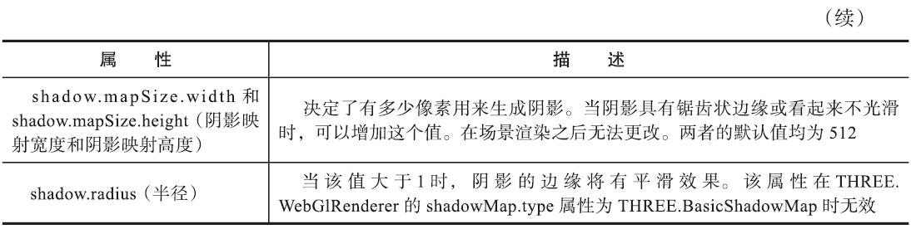

* 添加光源

  ```javascript
  var spotLight = new THREE.SpotLight("#ffffff");
  spotLight.position.set(-40, 60, -10);
  spotLight.castShadow = true;
  spotLight.shadow.camera.near = 1;
  spotLight.shadow.camera.far = 100;
  spotLight.target = plane;
  spotLight.distance = 0;
  spotLight.angle = 0.4;
  spotLight.shadow.camera.fov = 120;
  scene.add(spotLight);
  ```

* 光源辅助

  * ```javascript
    var debugCamera = new THREE.CameraHelper(spotLight.shadow.camera);
    scene.add(debugCamera);
    ```

  * ```javascript
    var pp = new THREE.SpotLightHelper(spotLight)
    scene.add(pp)
    ```

### PointLight

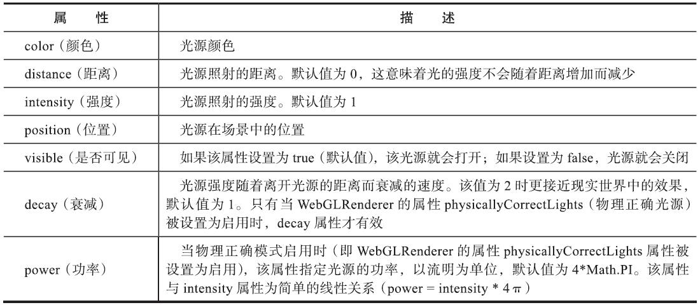

* 添加光源

  ```javascript
  var pointColor = "#ccffcc";
  var pointLight = new THREE.PointLight(pointColor);
  pointLight.decay = 0.1
  pointLight.castShadow = true;
  scene.add(pointLight);
  ```

### DirectionalLight平行光

* 添加光源

  ```javascript
  var pointColor = "#ff5808";
  var directionalLight = new THREE.DirectionalLight(pointColor);
  directionalLight.position.set(-40, 60, -10); 
  directionalLight.castShadow = true;
  directionalLight.shadow.camera.near = 2;
  directionalLight.shadow.camera.far = 80;
  directionalLight.shadow.camera.left = -30;
  directionalLight.shadow.camera.right = 30;
  directionalLight.shadow.camera.top = 30;
  directionalLight.shadow.camera.bottom = -30;
  directionalLight.intensity = 0.5;
  directionalLight.shadow.mapSize.width = 1024;
  directionalLight.shadow.mapSize.height = 1024;
  scene.add(directionalLight);
  ```

### HemisphereLight半球光(更加贴近户外自然光照效果)

* 添加光源

  ```javascript
  var hemiLight = new THREE.HemisphereLight(0x0000ff, 0x00ff00, 0.6);
  hemiLight.position.set(0, 500, 0);
  scene.add(hemiLight);
  ```

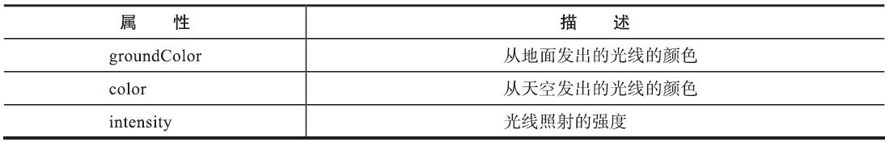

### AreaLight(发光区域)

* 引用js

  ```javascript
  <script type="text/javascript" charset="UTF-8" src="../../libs/three/three.js"></script>
  <script type="text/javascript" charset="UTF-8" src="../../libs/three/controls/TrackballControls.js"></script>
  <script type="text/javascript" charset="UTF-8" src="../../libs/three/lights/RectAreaLightUniformsLib.js"></script>
  ```

* 添加光源

  ```javascript
  var areaLight1 = new THREE.RectAreaLight(0xff0000, 500, 4, 10);//光的颜色0xff0000，光强500，长4。宽10
  areaLight1.position.set(-10, 10, -35);
  scene.add(areaLight1);
  ```

### 镜头光晕

* 创建光晕 ``var lensFlare = new THREE.Lensflare(texture,size,distance,blending,color,opcity);``

  ```javascript
  var texture = THREE.ImageUtils.loadTexture("../../assets/textures/flares/lensflare0.png"); 
  var flareColor = new THREE.Color(0xffaacc);
  var lensFlare = new THREE.Lensflare();
  // THREE.LensflareElement(texture, size, distance, color);
  lensFlare.addElement(new THREE.LensflareElement(textureFlare0, 350, 0.0, flareColor));
  ```


# 材质

### 材质列表

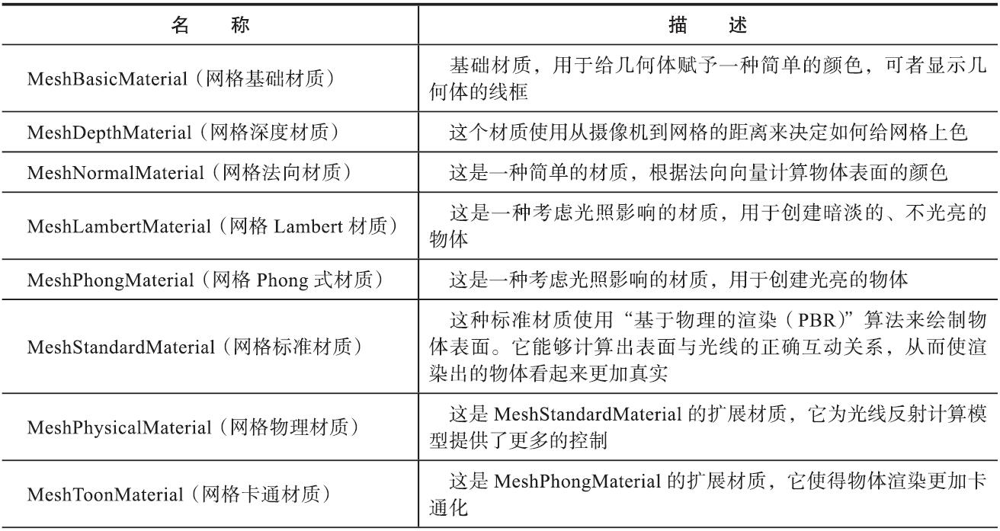

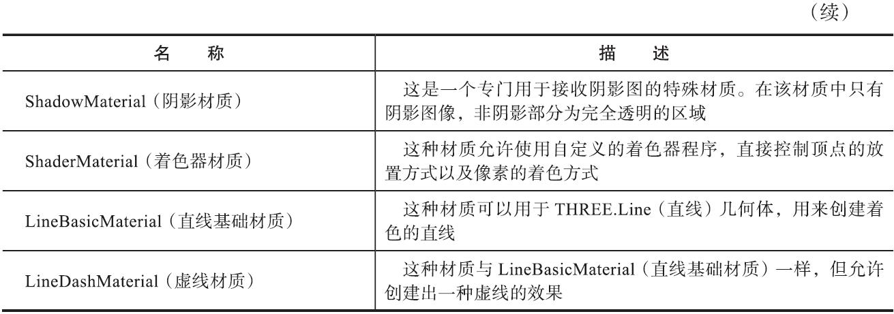


### 材质基本属性：THREE.Material

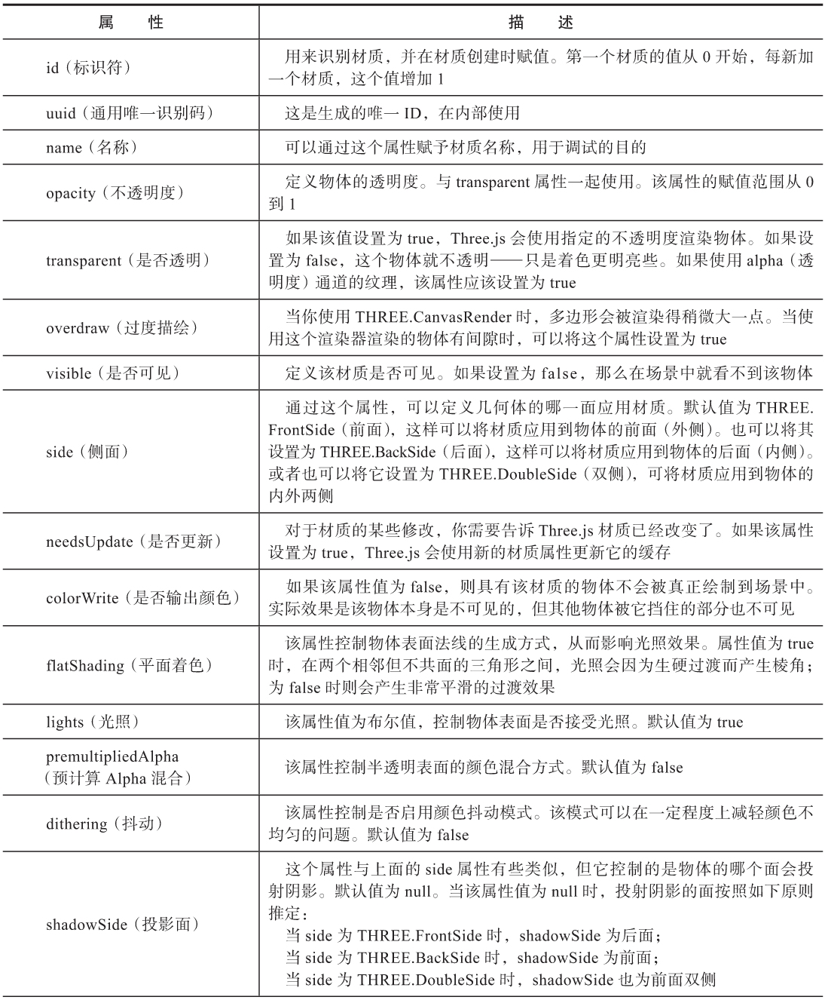

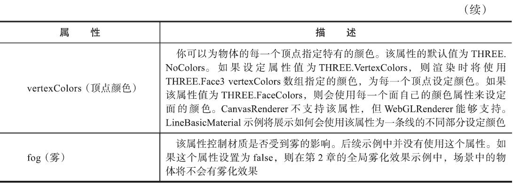

| 属性 | 使用                 |
| ---- | -------------------- |
| side | 0:前面，1后面，2两面 |
|      |                      |
|      |                      |


### 融合属性


### 高级属性

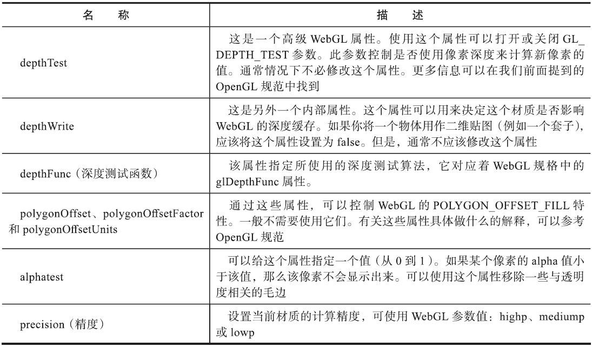

### MeshBasicMaterial

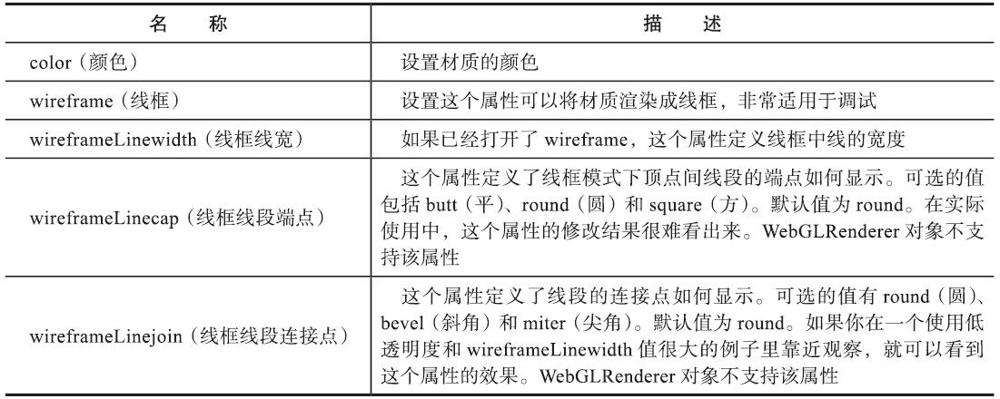

* 特性
  * 不会被光照影响
  * 可以显示线框

* 创建材质并赋值

  * ```javascript
    var meshMaterial = new THREE.MeshBasicMaterial({
        color: 0x7777ff,
        name: 'Basic Material',
        flatShading: true
    });
    ```

  * ```javascript
    var meshMaterial = new THREE.MeshBasicMaterial();
    meshMaterial.color = new THREE.Color(0x7777ff);
    meshMaterial.name = 'Material';
    meshMaterial.flatShading = true;
    ```

### MeshDepthMaterial

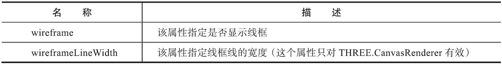

* 特性
  * 外观由摄像机的远近决定

* 创建

  * ```javascript
    var meshMaterial = new THREE.MeshDepthMaterial();//不需要任何参数
    ```

    

### 联合材质

* 创建

  ```javascript
  var cubeMaterial = new THREE.MeshDepthMaterial();
  var colorMaterial = new THREE.MeshBasicMaterial({
      color: controls.color,
      transparent: true,//必须
      blending: THREE.MultiplyBlending//指定融合模式（当前景色与背景色相乘）
  });
  var cube = new THREE.SceneUtils.createMultiMaterialObject(cubeGeometry, [colorMaterial,cubeMaterial]);
  cube.children[1].scale.set(0.99, 0.99, 0.99);
  ```

  

### MeshNormalMaterial

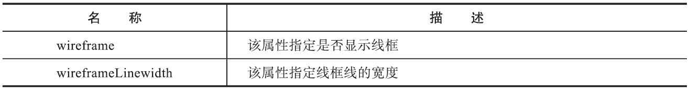


### 在简单几何体上使用多种材质

* 定义材质集合

  ```javascript
   var mats = [];
    mats.push(new THREE.MeshBasicMaterial({color: 0x009e60}));
    mats.push(new THREE.MeshBasicMaterial({color: 0x0051ba}));
    mats.push(new THREE.MeshBasicMaterial({color: 0xffd500}));
    mats.push(new THREE.MeshBasicMaterial({color: 0xff5800}));
    mats.push(new THREE.MeshBasicMaterial({color: 0xC41E3A}));
    mats.push(new THREE.MeshBasicMaterial({color: 0xffffff}));
  ```

* 定义几何体

  ```javascript
  var cubeGeom = new THREE.BoxGeometry(2.9, 2.9, 2.9);
  ```

* 合并

  ```javascript
  var cube = new THREE.Mesh(cubeGeom, mats);
  ```

  

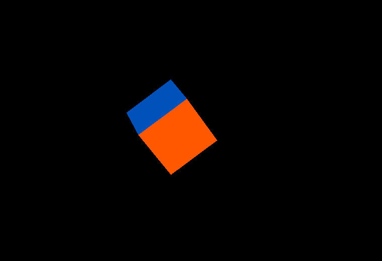


>在three.js中，一个正方体有12个小三角，Three.js会自动将几何体相同侧面组合在一起，使用同一种材质，每一侧使用一种材质
>
>我们可以自定义每个小三角的材质
>
>```javascript
>var cubeGeom = new THREE.BoxGeometry(2.9, 2.9, 2.9);
>cubeGeom.faces[1].materialIndex =6;
>cubeGeom.faces[2].materialIndex = 5;
>cubeGeom.faces[3].materialIndex = 4;
>cubeGeom.faces[5].materialIndex = 3;
>cubeGeom.faces[7].materialIndex =1;
>var cube = new THREE.Mesh(cubeGeom, mats);
>```
>
>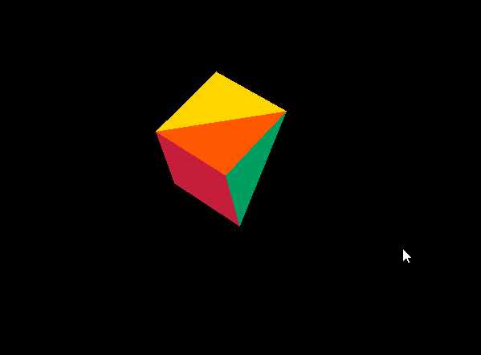
>
>

### MeshL ambertMaterial

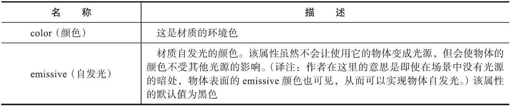

* 创建材质

  ```javascript
  var meshMaterial = new THREE.MeshLambertMaterial({color: 0x7777ff});
  ```


### MeshPhongMaterial

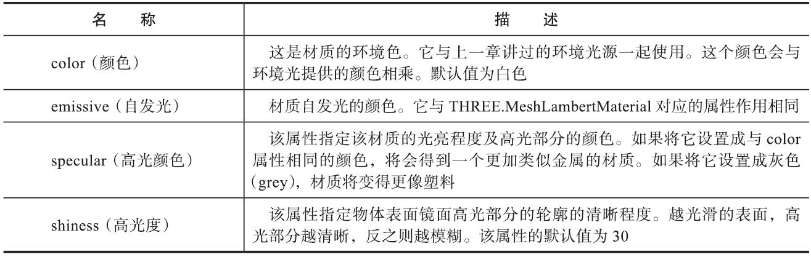

* 创建材质

  ```javascript
  var meshMaterial = new THREE.MeshPhongMaterial({color: 0x7777ff});
  ```

* 拓展材质

  MeshToonMaterial


### MeshStandardMaterial（塑料质感和金属质感）

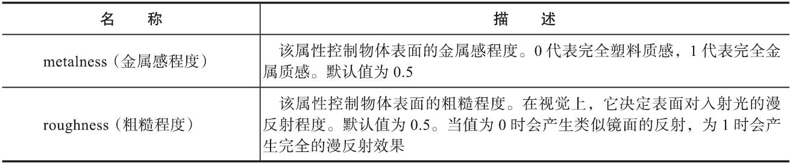

### MeshPhysicalMaterial

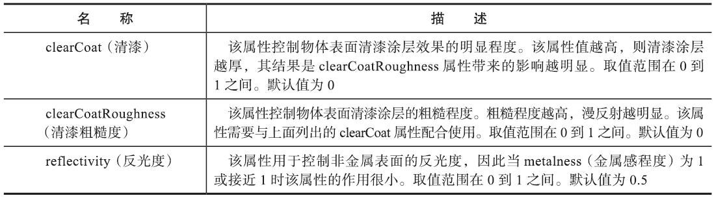

### ShaderMaterial（创建自己的着色器）

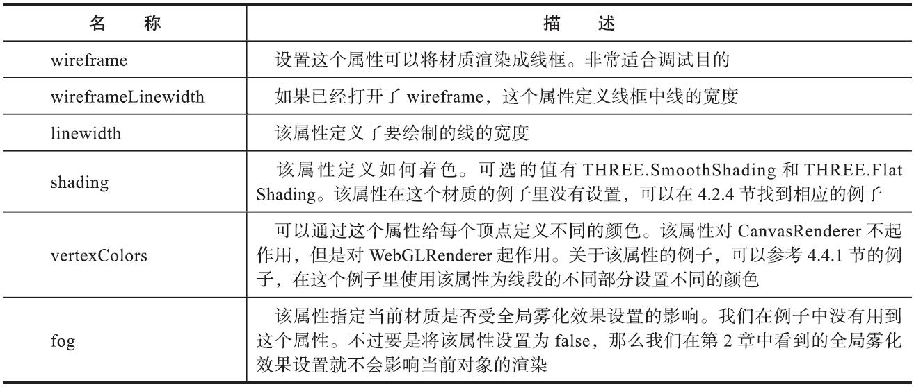

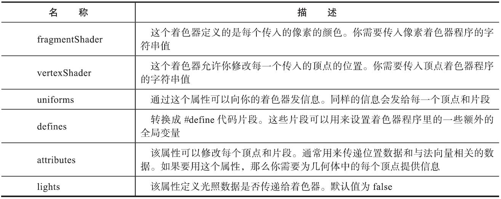

创建自己的材质

* vertex-shader

  >改变顶点 https://www.shadertoy.com/
  >
  >```javascript
  >  <script id="vertex-shader" type="x-shader/x-vertex">
  >      uniform float time;  //统一值
  >      varying vec2 vUv;
  >      void main()
  >      {
  >          vec3 posChanged = position; //接收顶点
  >          posChanged.x = posChanged.x*(abs(sin(time*1.0)));
  >          posChanged.y = posChanged.y*(abs(cos(time*1.0)));
  >          posChanged.z = posChanged.z*(abs(sin(time*1.0)));
  >          //gl_Position = projectionMatrix * modelViewMatrix * vec4(position*(abs(sin(time)/2.0)+0.5),1.0);
  >          gl_Position = projectionMatrix * modelViewMatrix * vec4(posChanged,1.0);//将顶点返回给THREE.js
  >      }
  >  </script>
  >```

* fragment-shader

  >自定义着色器  https://glslsandbox.com/
  >
  >```javascript
  ><script id="fragment-shader-1" type="x-shader/x-fragment">
  >    precision mediump float;
  >    uniform float time;
  >    uniform vec2 mouse;
  >    uniform vec2 resolution;
  >    void main( void ) {
  >              vec2 position = gl_FragCoord.xy / resolution.xy;
  >              float m = position.x;
  >              gl_FragColor = vec4( m, m, m, 1.0 );
  >    }
  ></script>
  >```

* 通过顶点和着色器创建材质

  >```javascript
  >var meshMaterial1 = createMaterial("vertex-shader","fragment-shader-1");
  > 
  >
  >function createMaterial(vertexShader, fragmentShader) {
  >    var vertShader = document.getElementById(vertexShader).innerHTML;
  >    var fragShader = document.getElementById(fragmentShader).innerHTML;
  >    var attributes = {};
  >    var uniforms = {
  >        time: {
  >            type: 'f',
  >            value: 0.2
  >        },
  >        scale: {
  >            type: 'f',
  >            value: 0.2
  >        },
  >        alpha: {
  >            type: 'f',
  >            value: 0.6
  >        },
  >        resolution: {
  >            type: "v2",
  >            value: new THREE.Vector2()
  >        }
  >    };
  >    uniforms.resolution.value.x = window.innerWidth;
  >    uniforms.resolution.value.y = window.innerHeight;
  >    var meshMaterial = new THREE.ShaderMaterial({
  >        uniforms: uniforms,
  >        vertexShader: vertShader,
  >        fragmentShader: fragShader,
  >        transparent: true
  >    });
  >    return meshMaterial;
  >}
  >```

* 循环渲染

  >```javascript
  >function render() {
  >    stats.update();
  >    cube.rotation.y = step += 0.01;
  >    cube.rotation.x = step;
  >    cube.rotation.z = step;
  >    cube.material.forEach(function (e) {
  >        e.uniforms.time.value += 0.01;
  >    });
  >    // render using requestAnimationFrame
  >    requestAnimationFrame(render);
  >    renderer.render(scene, camera);
  >}
  >```

### LineBasicMaterial

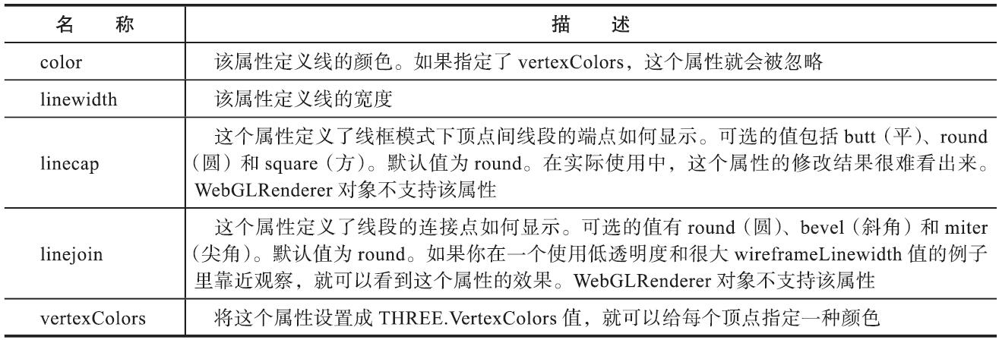

* 创建线条

  ```javascript
  const material2 = new THREE.LineBasicMaterial( { color: 0x0000ff } ); // 定义材质
  const points2 = [];//定义顶点
  points2.push( new THREE.Vector3( - 10, 0, 0 ) );
  points2.push( new THREE.Vector3( 0, 10, 0 ) );
  points2.push( new THREE.Vector3( 10, 0, 0 ) );
  points2.push( new THREE.Vector3( - 10, 0, 0 ) );
  //将顶点连接起来
  //线是画在每一对连续的顶点之间的，而不是在第一个顶点和最后一个顶点之间绘制线条（线条并未闭合）
  const geometry = new THREE.BufferGeometry().setFromPoints( points2 );
  const line2 = new THREE.Line( geometry, material2 );
  scene.add( line2 );
  ```

### LineDashedMaterial(虚线材质)

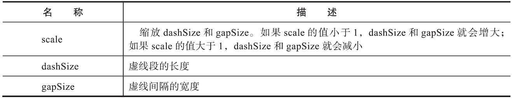

* 创建虚线

  ```javascript
  const material2 = new THREE.LineDashedMaterial( { 
      color: 0x0000ff ,
      dashSize :2,
      gapSize :2
  });
  const points2 = [];
  points2.push( new THREE.Vector3( - 10, 0, 0 ) );
  points2.push( new THREE.Vector3( 0, 10, 0 ) );
  points2.push( new THREE.Vector3( 10, 0, 0 ) );
  points2.push( new THREE.Vector3( - 10, 0, 0 ) );
  
  const geometry = new THREE.BufferGeometry().setFromPoints( points2 );
  const line2 = new THREE.Line( geometry, material2 );
  line2.computeLineDistances(); //计算线段顶点之间的距离
  scene.add( line2 );
  ```


# 几何体

基类 THREE.Geometry，THREE.BufferGeometry(性能较好，但是比较难以使用)

### Geometry


### BufferGeometry


* 相互转换

  ```javascript
  const normalGeometry= new THREE.Geometry();
  normalGeometry.fromBufferGeometry(bufferGeometry);
  
  const bufferGeometry= new THREE.BufferGeometry();
  bufferGeometry.fromGeometry(normalGeometry);
  ```

### 二维几何体

#### THREE.PlaneGeometry（二维矩形）

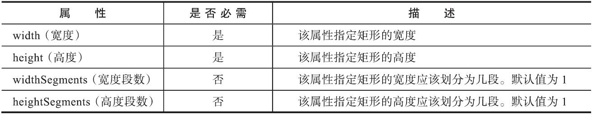

* 创建二维矩形

  ```javascript
  //THREE.PlaneGeometry(width,height,widthSegments,heightSegments);
  const planeGeometry = new THREE.PlaneGeometry(20,20,4,4);
  ```

* 获取它的属性

  ```javascript
  const width = planeGeometry.parameters.width
  ```


#### CircleGeometry（圆）


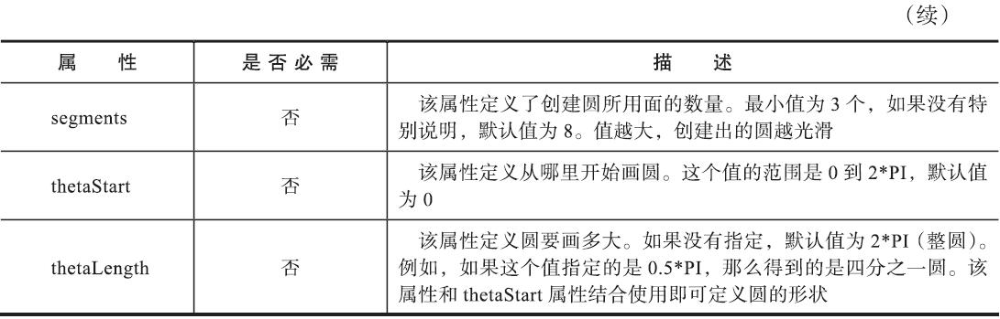

* 创建圆

  * ```javascript
    new THREE.CircleGeometry(3,12);//创建半径为3，由12个小三角形组成的圆，后面的值越大，圆越光滑
    ```

  * ```javas
    new THREE.CircleGeometry(3,12,0,Math.PI);//创建半径为3，由12个小三角组成的半圆(从0度开始，一共π度，即半圆)
    ```


#### RingGeometry（圆环）

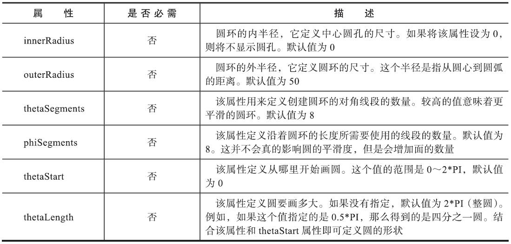

* 定义圆环

  * ```javascript
    const ring = new THREE.RingGeometry();
    ```


#### ShapeGeometry(自定义二维图形)

* THREE.Shape

  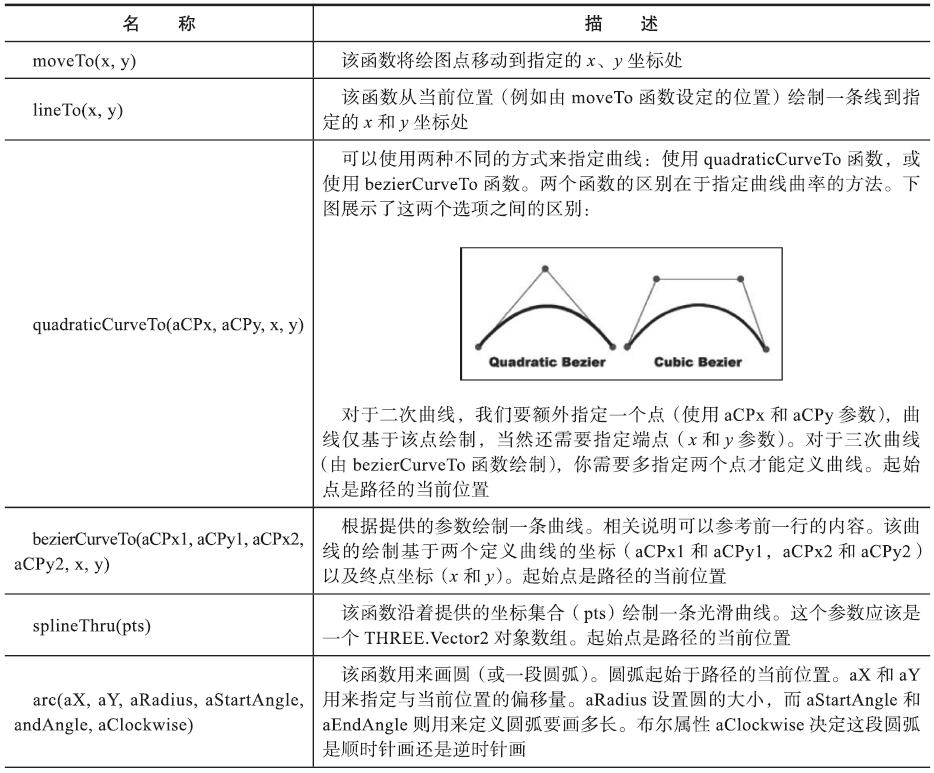

  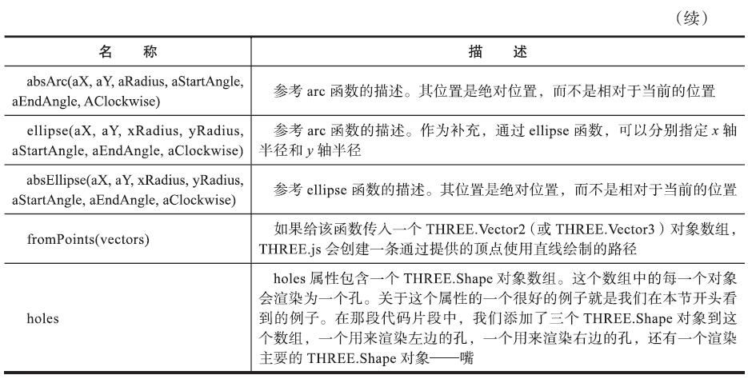

  * ```javascript
    function drawShape() {
      var shape = new THREE.Shape();
    
      shape.moveTo(10,10);   // startpoint
    
      shape.lineTo(10, 40);//线条
    
      shape.bezierCurveTo(15, 25, 25, 25, 30, 40);//曲线
    
      shape.splineThru( //样条曲线
        [new THREE.Vector2(32, 30),
          new THREE.Vector2(28, 20),
          new THREE.Vector2(30, 10),
        ]);
    
      shape.quadraticCurveTo(20, 15, 10, 10);
    
      var hole1 = new THREE.Path();  // add 'eye' hole one
      hole1.absellipse(16, 24, 2, 3, 0, Math.PI * 2, true);
      shape.holes.push(hole1);
    
      var hole2 = new THREE.Path();  // add 'eye hole 2'
      hole2.absellipse(23, 24, 2, 3, 0, Math.PI * 2, true);
      shape.holes.push(hole2);
    
      var hole3 = new THREE.Path();  // add 'mouth'
      hole3.absarc(20, 16, 2, 0, Math.PI, true);
      shape.holes.push(hole3);
      return shape;
    }
    ```

* THREE.ShapeGeometry

  * ```javascript
    new THREE.Geometry(drawShape())；
    ```

  * ```javascript
    shape.makeGeometry(opions);
    ```

    

### 三维几何

#### 基础几何体

##### BoxGeometry（立方体）

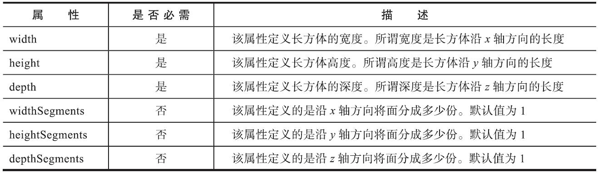

* 创建BoxGeometry

  ```javascript
  new THREE.BOXGeometry(10,10,10);
  ```

##### SphereGeometry（球体）（sfir）


##### CylinderGeometry(圆柱体)(silinder)

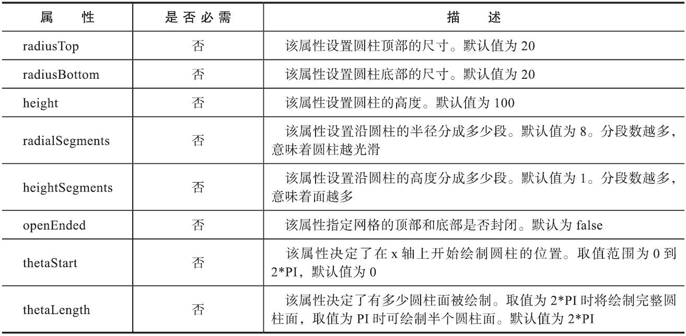

##### ConeGeometry（圆锥体）

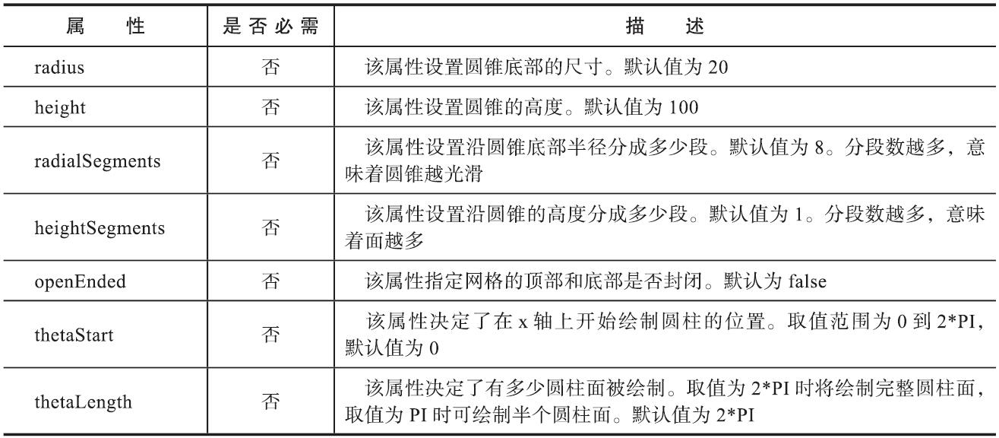

##### TorusGeometry(圆环体)

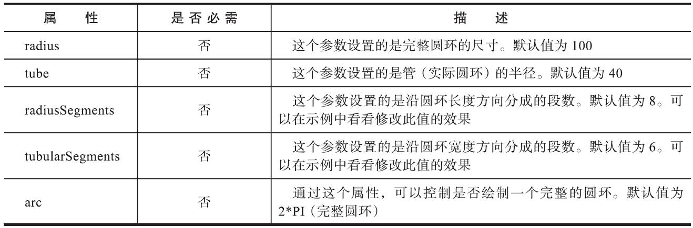

##### TorusKnotGeometry(圆环节)

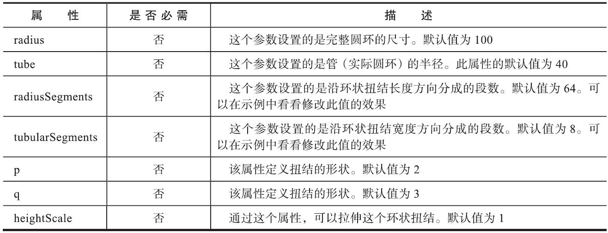

##### PolyhedronGometry（自定义多面体）

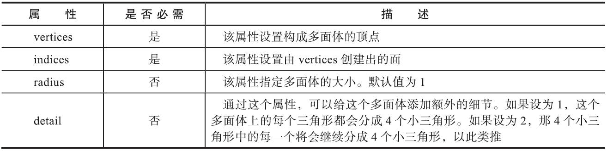

##### IcosahedronGeometry (二十面体)

##### TetrahedronGeometry(正四面体)

##### OctahedronGeometry(正八面体)

##### DodecahedronGeometry(正十二面体)

#### 高级几何体

##### ConvexGeometry (凸几何体（把全部顶点都包含在该几何体内）)

* 创建几何体

  ```javascript
  var convexGeometry = new THREE.ConvexGeometry(points);
  convexGeometry.computeVertexNormals();//计算顶点
  convexGeometry.computeFaceNormals();//计算面
  convexGeometry.normalsNeedUpdate = true;//更新
  scene.add(convexGeometry);
  ```

##### LatheGeometry

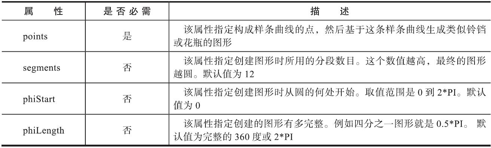

#### 拉伸创建几何体

##### ExtrudeGeoemtry

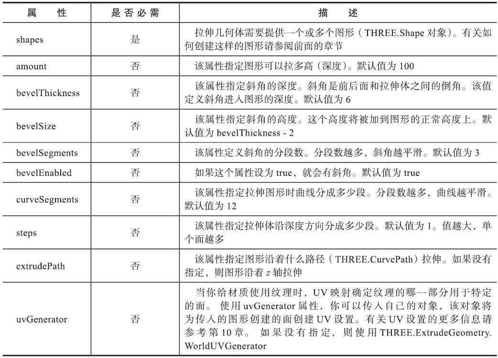

* 创建

  ```javascript
  var controls = new function () {
  
      this.appliedMaterial = applyMeshNormalMaterial
      this.castShadow = true;
      this.groundPlaneVisible = true;
      this.amount = 2;
      this.bevelThickness = 2;
      this.bevelSize = 0.5;
      this.bevelEnabled = true;
      this.bevelSegments = 3;
      this.bevelEnabled = true;
      this.curveSegments = 12;
      this.steps = 1;
  
      // redraw function, updates the control UI and recreates the geometry.
      this.redraw = function () {
          redrawGeometryAndUpdateUI(gui, scene, controls, function() {
              var options = {
                  amount: controls.amount,
                  bevelThickness: controls.bevelThickness,
                  bevelSize: controls.bevelSize,
                  bevelSegments: controls.bevelSegments,
                  bevelEnabled: controls.bevelEnabled,
                  curveSegments: controls.curveSegments,
                  steps: controls.steps
              };
  
              var geom = new THREE.ExtrudeGeometry(drawShape(), options);
              geom.applyMatrix(new THREE.Matrix4().makeTranslation(-20, 0, 0));
              geom.applyMatrix(new THREE.Matrix4().makeScale(0.4,0.4,0.4));
              return geom
          });
      };
  };
  
  ```

###### 拉伸SVG

* 引入库

  ```javascript
  <script type="text/javascript" charset="UTF-8" src="../../libs/other/d3-threeD.js"></script>
  ```

* 前端写入svg

  ```html
      <div id="batman" style="display:none">
          <svg version="1.0" xmlns="http://www.w3.org/2000/svg" xmlns:xlink="http://www.w3.org/1999/xlink" x="0px" y="0px" width="1152px"
              height="1152px" xml:space="preserve">
              <g>
                  <path id="batman-path" style="fill:rgb(0,0,0);" d="M 261.135 114.535 C 254.906 116.662 247.491 118.825 244.659 119.344 C 229.433 122.131 177.907 142.565 151.973 156.101 C 111.417 177.269 78.9808 203.399 49.2992 238.815 C 41.0479 248.66 26.5057 277.248 21.0148 294.418 C 14.873 313.624 15.3588 357.341 21.9304 376.806 C 29.244 398.469 39.6107 416.935 52.0865 430.524 C 58.2431 437.23 63.3085 443.321 63.3431 444.06 C 63.4748 446.883 102.278 479.707 120.51 492.418 C 131.003 499.734 148.168 509.93 158.654 515.075 C 169.139 520.22 179.431 525.34 181.524 526.454 C 187.725 529.754 187.304 527.547 179.472 515.713 C 164.806 493.553 158.448 464.659 164.322 446.861 C 169.457 431.303 192.013 421.501 214.324 425.132 C 234.042 428.341 252.142 439.186 270.958 459.064 C 286.677 475.67 292.133 482.967 295.31 491.634 C 297.466 497.514 298.948 495.91 304.862 481.293 C 313.673 459.519 329.808 445.735 346.35 445.851 C 367.654 446 399.679 478.239 412.801 512.745 C 414.093 516.144 416.593 522.632 418.355 527.163 C 420.118 531.695 423.604 542.319 426.103 550.773 C 430.848 566.832 432.355 566.851 434.872 550.88 C 436.395 541.215 451.403 502.522 455.655 497.298 C 457.038 495.599 460.63 489.896 463.636 484.625 C 471.696 470.498 492.318 452.688 505.387 448.568 C 514.602 445.663 517.533 445.549 525.51 447.782 C 539.676 451.749 553.43 467.773 560.706 488.788 L 563.242 496.114 L 567.096 490.012 C 577.709 473.208 593.665 453.899 602.47 447.206 C 607.884 443.09 613.378 438.825 614.679 437.729 C 615.98 436.632 622.927 433.259 630.118 430.233 C 655.159 419.693 681.195 423.407 693.273 439.241 C 697.957 445.382 698.932 448.971 699.538 462.294 C 700.174 476.284 699.51 479.864 693.686 493.854 C 690.073 502.533 684.912 512.883 682.217 516.854 C 679.523 520.825 678.172 524.074 679.215 524.074 C 681.932 524.074 718.787 504.481 732.525 495.734 C 760.018 478.228 788.909 452.599 803.9 432.418 C 807.266 427.886 810.569 423.715 811.239 423.149 C 814.498 420.395 828.253 393.099 833.17 379.627 C 838.223 365.782 838.713 361.822 838.741 334.582 C 838.776 300.425 836.431 291.124 820.154 260.873 C 810.649 243.207 807.498 239.005 788.417 218.543 C 751.511 178.968 688.147 142.549 621.582 122.654 C 581.7 110.734 580.388 110.465 580.388 114.195 C 580.388 115.328 581.302 116.255 582.418 116.255 C 584.279 116.255 587.705 122.106 603.399 152.085 C 613.977 172.29 618.077 189.427 618.264 214.21 C 618.42 234.928 617.88 238.368 612.285 252.269 C 604.327 272.04 590.066 286.889 572.829 293.352 C 558.526 298.714 549.193 297.86 535.704 289.955 C 526.777 284.723 512.304 267.644 509.816 259.404 C 509.132 257.138 507.129 251.358 505.366 246.558 C 503.602 241.759 501.646 231.564 501.018 223.902 C 500.39 216.24 498.491 198.402 496.797 184.261 C 495.104 170.121 493.307 152.047 492.803 144.097 C 492.299 136.147 491.292 125.625 490.565 120.715 L 489.242 111.787 L 483.323 118.267 C 480.067 121.832 477.404 125.618 477.404 126.681 C 477.404 127.744 476.603 128.613 475.624 128.613 C 474.645 128.613 471.275 132.321 468.135 136.852 L 462.426 145.091 L 431.038 145.091 L 399.65 145.091 L 386.811 128.494 C 379.749 119.365 373.509 112.36 372.943 112.926 C 372.377 113.491 371.57 118.875 371.15 124.888 C 370.73 130.902 368.94 147.744 367.172 162.315 C 365.405 176.887 363.523 195.424 362.99 203.509 C 360.283 244.622 352.784 266.044 335.323 282.544 C 326.456 290.923 312.488 297.497 303.508 297.518 C 294.864 297.539 278.732 290.063 269.473 281.748 C 246.952 261.521 238.846 229.614 245.481 187.314 C 247.894 171.928 266.562 131.612 275.927 121.56 C 277.987 119.348 279.673 116.786 279.673 115.867 C 279.673 114.947 279.905 113.593 280.188 112.856 C 281.28 110.017 271.977 110.837 261.136 114.536 L 261.135 114.535 "
                  />
              </g>
  
          </svg>
      </div>
  
  ```

  

* 将svg导入

  ```javascript
  function drawShape() {
  
      var svgString = document.querySelector("#batman-path").getAttribute("d");
  
      var shape = transformSVGPathExposed(svgString);
  
      // return the shape
      return shape;
  }
  ```

* 拉伸

  ```javascript
  new THREE.ExtrudeGeometry(drawShape(), options)
  ```


##### TubeGeometry

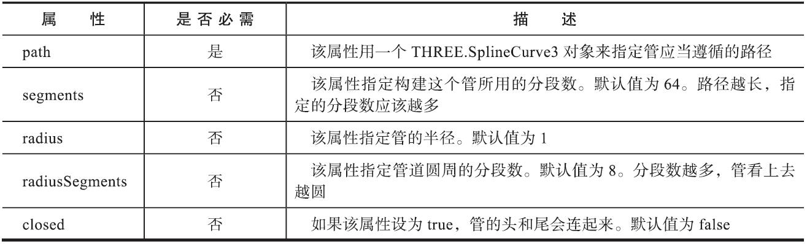

* 创建过程

  * 创建顶点 points

  * 将顶点转换成 THREE.CatmullRomCurve3对象，将这些点定义成一条平滑曲线

  * 通过构建函数进行创建

    *  ```javascript
       new THREE.TubeGeometry(new THREE.CatmullRomCurve3(points), segments, radius, radiusSegments, closed);
       ```

      


#### ParametricGeometry(基于等式的几何体)

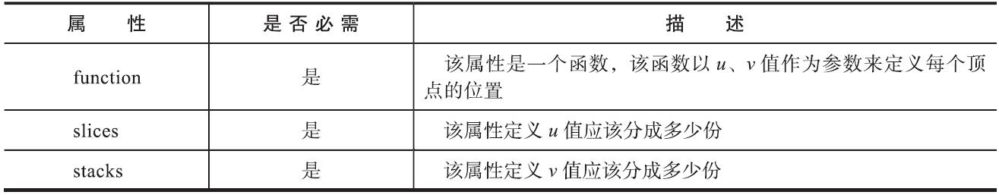


* 创建函数

  ```javascript
  radialWave = function (u, v, optionalTarget) {
      var result = optionalTarget || new THREE.Vector3();
      var r = 50;
      var x = Math.sin(u) * r;
      var z = Math.sin(v / 2) * 2 * r;
      var y = (Math.sin(u * 4 * Math.PI) + Math.cos(v * 2 * Math.PI)) * 2.8;
      return result.set( x, y, z );
  };

* ParametricGeometry调用该函数

  ```javascript
  new THREE.ParametricGeometry(radialWave, 50, 50);
  ```

#### 创建三维文本

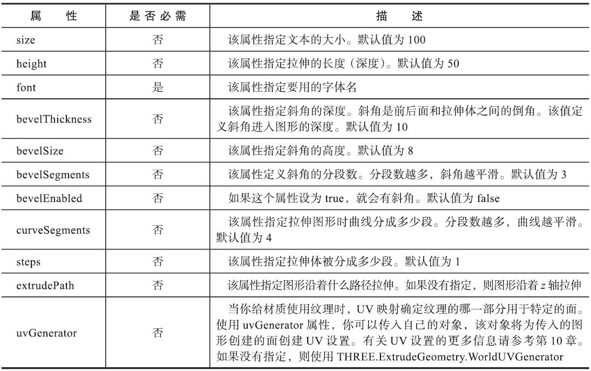

* 加载字体

  ```javascript
  var fontload1 = new THREE.FontLoader();
  fontload1.load( '../../assets/fonts/bitstream_vera_sans_mono_roman.typeface.json', function ( response ) {
      controls.font = response;
      font_bitstream = response;
      controls.redraw();
      render();
  });
  ```

* 创建三维字体

  ```javascript
  new THREE.TextGeometry("Learning Three.js", options);//options包括他的属性
  ```

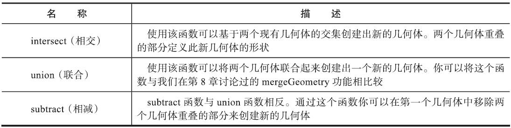

* 添加库

  * 预先编译成javascript文件，直接调用

    * 安装CoffeeScript

    * 将ThreeBSP文件从coffeeScript转换成javascript

      ```coffeescript
      coffee --complie ThreeBSP.coffee
      ```

    * 引用ThreeBSP.js

#### subtract

>相减

* 将定义好的几何体变成ThreeBSP

  ```javascript
  var sphere1BSP = new ThreeBSP(sphere1);
  var sphere2BSP = new ThreeBSP(sphere2);
  var cube2BSP = new ThreeBSP(cube);
  ```

* sphere1BSP使用subtract函数

  ```javascript
   resultBSP = sphere1BSP.subtract(sphere2BSP);
   resultBSP = sphere1BSP.subtract(cube2BSP);
  ```

* 将得到的结果重新计算渲染

  ```javascript
  result = resultBSP.toMesh();
  result.geometry.computeFaceNormals();
  result.geometry.computeVertexNormals();
  scene.add(result);
  ```

#### intersect 

>重叠部分会保存

#### union （鸡肋）

>组合在一起


# 粒子与精灵

### sprite（精灵）

* 创建少量精灵 (少量使用sprite)

  ```javascript
  var material1 = new THREE.SpriteMaterial({ color:Math.random() * 0xffffff });
  var sprite1 = new THREE.Sprite(material); //材质
  sprite1.position.set(0,0,0);//位置
  
  var material2 = new THREE.SpriteCanvasMaterial({ color:Math.random() * 0xffffff  });
  var sprite2 = new THREE.Sprite(material2);
  sprite2.position.set(10,10,10);
  ```

### points

* 创建大量点

  ```javascript
  var geom = new THREE.Geometry();
  var material = new THREE.PointsMaterial({
      size: 2,
      vertexColors: true,
      color: 0xffffff
  });
  
  for (var x = -15; x < 15; x++) {
      for (var y = -10; y < 10; y++) {
          var particle = new THREE.Vector3(x * 4, y * 4, 0); //point 的位置
          geom.vertices.push(particle);
          geom.colors.push(new THREE.Color(Math.random() * 0xffffff)); // point的材质
      }
  }
  
  var cloud = new THREE.Points(geom, material);
  scene.add(cloud);
  ```


### 使用HTML画布样式化粒子

#### SpriteCanvasMaterial(只能使用CanvasRenderer渲染器)


* 定义粒子外观

  ```javascript
  var getTexture = function (ctx) {
      。。。。。
  };
  ```

* 创建SpriteCanvasMaterial材质

  ```javascript
  var material = new THREE.SpriteCanvasMaterial({
      program: getTexture
  });
  ```

* 创建sprite

  ```javascript
  var sprite = new THREE.Sprite(material);
  sprite.position.set(Math.random() * range - range / 2, Math.random() * range - range / 2, Math.random() *
                      range - range / 2);
  sprite.scale.set(0.1, 0.1, 0.1);
  scene.add(sprite);
  ```


#### PointsMaterial

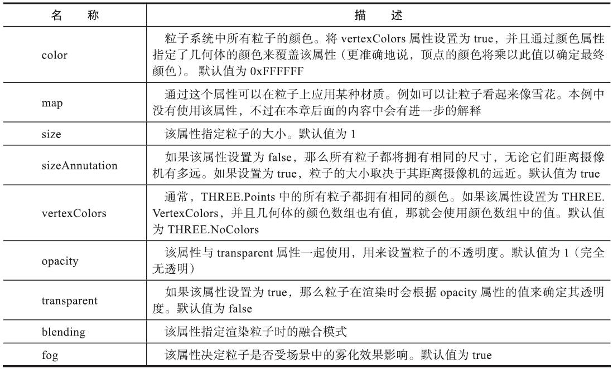

* 定义粒子外观

* 创建PointsMaterial材质

  ```javascript
  var material = new THREE.PointsMaterial({
      size: size,
      transparent: transparent,
      opacity: opacity,
      map: createGhostTexture(), // 通过map引用之前定义的粒子外观
      sizeAttenuation: sizeAttenuation,
      color: color
  });
  
* 创建points

  ```javascript
  var geom = new THREE.Geometry();
  var particle = new THREE.Vector3(Math.random() * range - range / 2, Math.random() * range - range / 2,
                                   Math.random() * range - range / 2);
  geom.vertices.push(particle);
  cloud = new THREE.Points(geom, material);//先创建几何体，然后一次性转换points
  cloud.name = 'points';
  scene.add(cloud);
  ```

  

#### SpriteMaterial

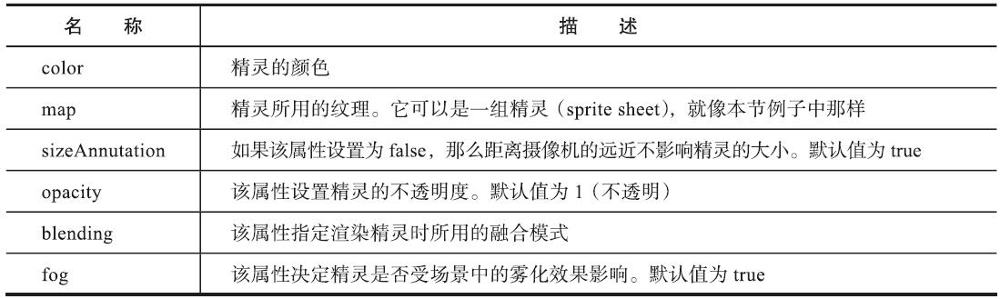

* 定义粒子外观

* 创建SpriteMaterial材质

  ```javascript
  var material = new THREE.SpriteMaterial({
      map: createGhostTexture(),
      color: 0xffffff
  });
  ```

* 创建sprite

  ```javascript
  var sprite = new THREE.Sprite(material);
  sprite.position.set(Math.random() * range - range / 2, Math.random() * range - range / 2, Math.random() *
                      range - range / 2);
  sprite.scale.set(4, 4, 4);
  scene.add(sprite); //创建一个sprite，添加一个sprite
  ```

  

### 使用纹理样式化粒子

* 加载纹理

  ```javascript
  var texture = new THREE.TextureLoader().load("../../assets/textures/particles/raindrop-3.png");
  ```

* 定义材质

  ```javascript
  var material = new THREE.PointsMaterial({
      size: size,
      transparent: transparent,
      opacity: opacity,
      map: texture,  // 通过map调用上面加载的材质
      blending: THREE.AdditiveBlending, // 在画新像素时，背景像素的颜色会画到新像素上
      sizeAttenuation: sizeAttenuation,
      color: color
  });
  ```

* 定义points

  ```javascript
  var geom = new THREE.Geometry();
  var range = 40;
  for (var i = 0; i < 1500; i++) {
      var particle = new THREE.Vector3(
          Math.random() * range - range / 2,
          Math.random() * range * 1.5,
          // Math.random() * range - range / 2
          1 + (i/100) // 实现排序
      )
      particle.velocityY = 0.1 + Math.random() / 5;
      particle.velocityX = (Math.random() - 0.5) / 3;
      geom.vertices.push(particle);
  }
  cloud = new THREE.Points(geom, material);
  cloud.sortParticles = true;
  cloud.name = "particles1"
  scene.add(cloud);
  ```

### 使用精灵贴图

* 创建单独的场景和相机

  ```javascript
  var sceneOrtho = new THREE.Scene();
  var cameraOrtho = new THREE.OrthographicCamera(0, window.innerWidth, window.innerHeight, 0, -10, 10);
  ```

* 加载自定义纹理

  ```javascript
  var getTexture = function () {
      var texture = new THREE.TextureLoader().load("../../assets/textures/particles/sprite-sheet.png"); //精灵贴图 包含5个精灵
      return texture;
  };
  ```

* 创建sprite

  ```javascript
  function createSprite(size, transparent, opacity, color, spriteNumber) {
      var spriteMaterial = new THREE.SpriteMaterial({  
          opacity: opacity,
          color: color,
          transparent: transparent,
          map: getTexture() // 通过map调用之前加载的纹理
      });
  
      // we have 1 row, with five sprites
      spriteMaterial.map.offset = new THREE.Vector2(0.2 * spriteNumber, 0);//决定纹理在 x轴(u) 和 y轴(v) 的偏移百分比
      spriteMaterial.map.repeat = new THREE.Vector2(1 / 5, 1);//放大x轴
      spriteMaterial.blending = THREE.AdditiveBlending;
      // make sure the object is always rendered at the front
      spriteMaterial.depthTest = false;
  
      var sprite = new THREE.Sprite(spriteMaterial);
      sprite.scale.set(size, size, size);
      sprite.position.set(100, 50, -10);
      sprite.velocityX = 5;
  
      sceneOrtho.add(sprite);
  }
  ```

* 更新render

  ```javascript
  webGLRenderer.render(scene, camera); // 先渲染正常的场景
  webGLRenderer.autoClear = false;// 渲染粒子前不会清空场景
  webGLRenderer.render(sceneOrtho, cameraOrtho);// 渲染额外的场景
  ```

### 从几何体中创建THREE.Points

* 从几何体中创建THREE.Points

  ```javascript
  var geom = new THREE.TorusKnotGeometry(controls.radius, controls.tube, Math.round(controls.radialSegments), Math.round(controls.tubularSegments), Math.round(controls.p), Math.round(controls.q));//几何体
  function createPoints(geom) {
      var material = new THREE.PointsMaterial({
          color: 0xffffff,
          size: 3,
          transparent: true,
          blending: THREE.AdditiveBlending,
          map: generateSprite(), // 自定义材质
          depthWrite: false // instead of sortParticles
      });
  
      var cloud = new THREE.Points(geom, material); // 通过几何体和材质，直接创建出Points
      return cloud;
  }
  ```

# 创建加载高级网格和几何体

### 组合与合并

#### 组合 

>将多个几何体放在组里

* 定义几何体

  ```javascript
  sphere = createMesh(new THREE.SphereGeometry(5, 10, 10));
  cube = createMesh(new THREE.BoxGeometry(6, 6, 6));
  ```

* 定义组

  ```javascript
  group = new THREE.Group();
  ```

* 向组里添加几何体

  ```javascript
  group.add(sphere);
  group.add(cube);
  scene.add(group);
  ```

>组内的几何体仍然可以单独的操作

#### 合并

* 定义几何体

  ```javascript
  var cubeSize = 1.0;
  var cubeGeometry = new THREE.BoxGeometry(cubeSize, cubeSize, cubeSize);
  var cube = new THREE.Mesh(cubeGeometry, cubeMaterial);
  ```

* 合并几何体

  ```javascript
  var geometry = new THREE.Geometry();
  cube.updateMatrix();
  geometry.merge(cube.geometry, cubeMesh.matrix);
  ```

优点：当需要合并的几何体非常多时，可以大幅度提高性能

缺点：无法获取到每个合并过后的几何体，意思就是合并之后的几何体无法操作，只能操作合并之后的那个大的几何体

### 从外部资源加载几何体

three.js支持可以读取的文件格式

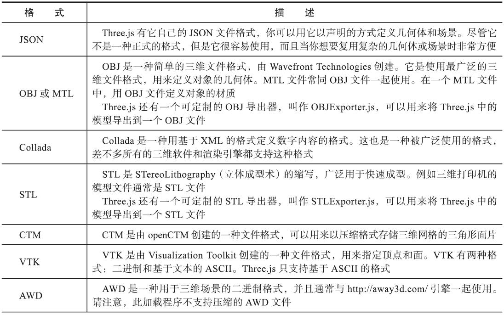

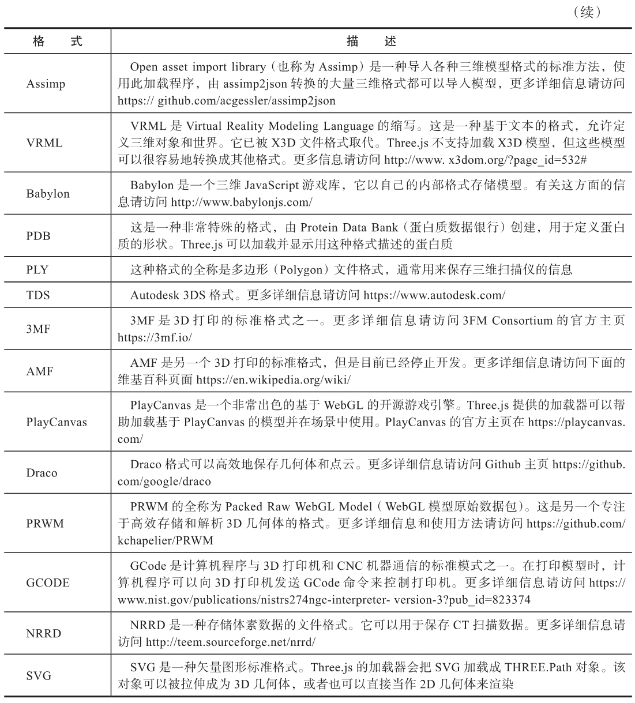

#### three.js导出为json格式(不完整)

* 几何体对象(可以是自己定义的，也可以是从外部加载的)

  ```javascript
  var knot = createMesh(new THREE.TorusKnotGeometry(10, 1, 64, 8, 2, 3));
  ```

* 导出为json格式的

  ```javascript
  var result = knot.toJSON(); //变成字符串
  localStorage.setItem("json", JSON.stringify(result));
  ```

* 加载json为Three.js

  ```javascript
  var json = localStorage.getItem("json");
  if (json) {
      var loadedGeometry = JSON.parse(json);
      var loader = new THREE.ObjectLoader();
  
      loadedMesh = loader.parse(loadedGeometry);
      loadedMesh.position.x -= 40;
      scene.add(loadedMesh);
  }
  ```

#### three.js导出为场景(完全导出)

```javascript
localStorage.setItem("scene", JSON.stringify(scene.toJson));
```

加载json为Three.js

```javascript
var sceneJson = localStorage.getItem("scene");
var loadedGeometry = JSON.parse(scene);
var loader = new THREE.ObjectLoader();
var scene = loader.parse(sceneJson);
```

从外部资源导入到three.js

* 引用对应格式的库

  ```javascript
   <script type="text/javascript" charset="UTF-8" src="../../libs/three/loaders/OBJLoader.js"></script>
  ```

* 获取对应的加载器并加载文件

  ```javascript
  var loaderScene = new BaseLoaderScene(camera);
  var loader = new THREE.OBJLoader();
  loader.load('../../assets/models/pinecone/pinecone.obj', function (mesh) {
  
      var material = new THREE.MeshLambertMaterial({
          color: 0x5C3A21
      });
      mesh.children.forEach(function (child) {
          child.material = material;
          child.geometry.computeVertexNormals();
          child.geometry.computeFaceNormals();
      });
      mesh.scale.set(120,120,120)
      loaderScene.render(mesh, camera);
  });
  ```


# 创建动画和移动相机

### 基础动画

#### 简单动画

##### 选择对象

* 基于鼠标点击位置创建vector3向量

  ```javascript
  var vector = new THREE.Vector3((event.clientX / window.innerWidth) * 2 - 1, -(event.clientY / window.innerHeight) * 2 + 1, 0.5);
  ```

* 将点击位置转换成three.js场景的坐标(将屏幕坐标转换成三维场景中坐标)

  ```javascript
  vector = vector.unproject(camera);
  ```

* 创建THREE.Raycaster  (从摄像头位置（camera.position）向鼠标点击位置发射光线)

  ```javascript
  var raycaster = new THREE.Raycaster(camera.position, vector.sub(camera.position).normalize());
  ```

* 使用raycaster.intersectObjects方法来判断指定的对象中哪些被光线照到，照到即表明鼠标点击时点中了该对象

  ```javascript
  var intersects = raycaster.intersectObjects([sphere, cylinder, cube]);
  if (intersects.length > 0) { // 判断上面三个是否被点中
      console.log(intersects[0]);
      intersects[0].object.material.transparent = true;
      intersects[0].object.material.opacity = 0.1;
  }
  ```

##### tween.js实现动画

>下载链接：https://github.com/sole/tween.js/
>
>很容易实现某个属性在两个值之间的过渡

* 定义过渡

  ```javascript
  var tween2 = new TWEEN.Tween({x:10}).to({x:3},10000).easing(TWEEN.Easing.Bounce.InOut); // x在10000ms内从10到3
  
  var posSrc = { pos: 1}  
  var tween = new TWEEN.Tween(posSrc).to({pos: 0}, 2000);
  tween.easing(TWEEN.Easing.Bounce.InOut);
  
  var tweenBack = new TWEEN.Tween(posSrc).to({pos: 1}, 2000); 
  tweenBack.easing(TWEEN.Easing.Bounce.InOut); 
  
  tweenBack.chain(tween); // 
  tween.chain(tweenBack); //x
  
  tween.start();
  ```

* 获取需要过渡的几何体(这儿是从外部加载的，也可以自己创建)

  ```javascript
  var loader = new THREE.PLYLoader();
  loader.load("../../assets/models/carcloud/carcloud.ply", function (geometry) {
      var material = new THREE.PointsMaterial({
          color: 0xffffff,
          size: 1,
          opacity: 0.6,
          transparent: true,
          blending: THREE.AdditiveBlending,
          depthWrite: false,
          map: generateSprite()
      });
  
      // copy the original position, so we can referene that when tweening
      var origPosition = geometry.attributes['position'].clone()//备份点的集合
      geometry.origPosition = origPosition
  
      var group = new THREE.Points(geometry, material);
      group.scale.set(2.5, 2.5, 2.5);
      loaderScene.render(group, camera);
  });
  ```

* 更新tween,使得几何体动起来

  ```javascript
  var loaderScene = new BaseLoaderScene(camera, false, false, function(mesh) {
  
      TWEEN.update();
  
      var positionArray = mesh.geometry.attributes['position']
      var origPosition = mesh.geometry.origPosition
  
      for (i = 0; i < positionArray.count ; i++) {
          var oldPosX = origPosition.getX(i);
          var oldPosY = origPosition.getY(i);
          var oldPosZ = origPosition.getZ(i);
          positionArray.setX(i, oldPosX * posSrc.pos);
          positionArray.setY(i, oldPosY * posSrc.pos);
          positionArray.setZ(i, oldPosZ * posSrc.pos);
      }
      positionArray.needsUpdate = true;
  });
  ```

  

### 使用摄像机

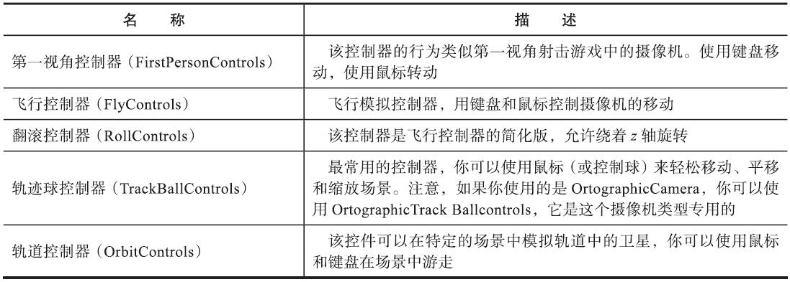

#### 轨迹球控制器TrackballControls

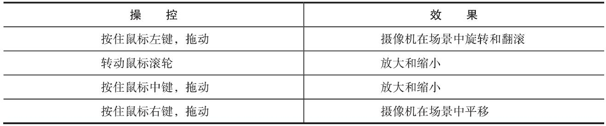

* 引用对应的js

* 创建控制器并绑定摄像机

  ```javascript
  var trackballControls = new THREE.TrackballControls(camera);
  trackballControls.rotateSpeed = 1.0;
  trackballControls.zoomSpeed = 1.0;
  trackballControls.panSpeed = 1.0;
  ```

* 更新摄像头

  ```javascript
  render();
  function render() {
      stats.update();
      //clock.getDelta()：精确计算出trackballControls.update()方法此次调用与上次调用的时间间隔（一个循环渲染所花费的时间）
      trackballControls.update(clock.getDelta());
      requestAnimationFrame(render);
      renderer.render(scene, camera)
  }   
  ```

  

#### 飞行控制器FlyControls


* 引用对应的js

* 创建控制器并绑定摄像机

  ```javascript
  var flyControls = new THREE.FlyControls(camera);//与摄像机绑定
  flyControls.movementSpeed = 25;
  flyControls.domElement = document.querySelector("webgl-output"); //与前端对象绑定
  flyControls.rollSpeed = Math.PI / 24;
  flyControls.autoForward = true;
  flyControls.dragToLook = false;
  ```

* 更新

#### 第一视角控制器FirstPersonControls

* 创建

  ```javascript
  var fpControls = new THREE.FirstPersonControls(camera);
  fpControls.lookSpeed = 0.2; //镜头旋转速度
  fpControls.movementSpeed = 20;//位移速度
  fpControls.lookVertical = true;
  fpControls.constrainVertical = true;
  fpControls.verticalMin = 1.0;
  fpControls.verticalMax = 2.0;
  fpControls.lon = -150; //初始时摄像机所指向的位置
  fpControls.lat = 120;  //初始时摄像机所指向的位置
  ```

#### 轨道控制器OrbitControls

* 创建

  ```javascript
  var orbitControls = new THREE.OrbitControls(camera);
  orbitControls.autoRotate = true;
  ```

# 加载使用纹理

### 将纹理应用于材质

#### 加载纹理应用于网格

作为贴图添加到材质（异步加载）

* 加载较小的纹理贴图

  ```javascript
  var textureLoader = new THREE.TextureLoader();
  textureLoader.load('../../assets/textures/general/floor-wood.jpg')
  ```

* 加载较大的纹理贴图

  ```javascript
  var textureLoader = new THREE.TextureLoader();
  textureLoader.load('../../assets/textures/general/floor-wood.jpg',onLoadFunction,onProgressFunction,onErrorFunction);
  //onLoadFunction 纹理加载完成被调用
  //onProgressFunction 随时汇报纹理加载进度
  //onErrorFunction 纹理加载或解析失败时被调用
  ```

##### 纹理缩放

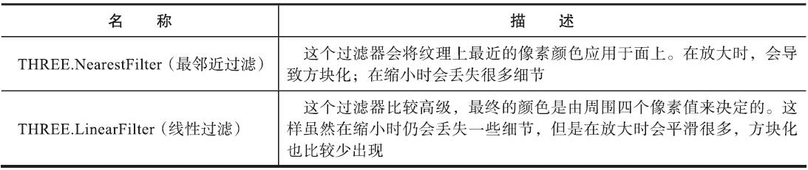

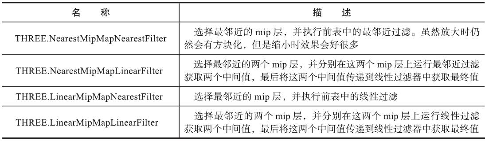

##### 纹理加载器

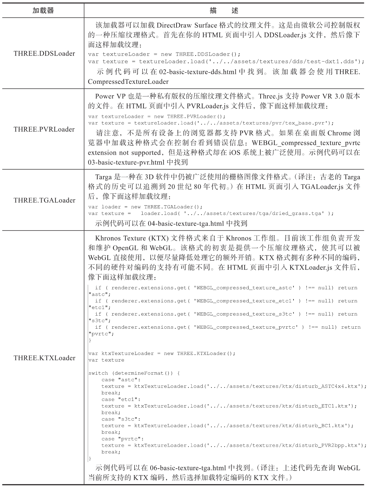

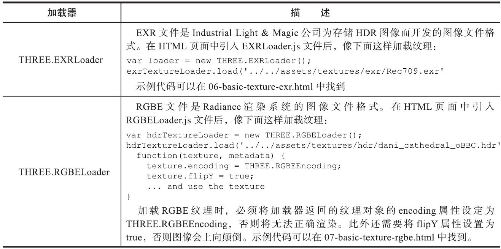

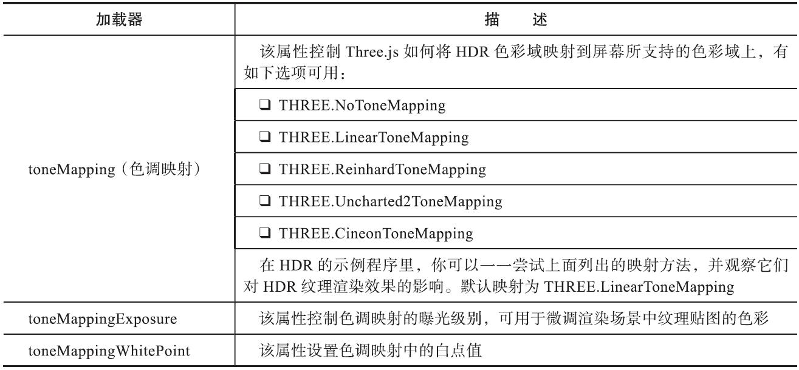

#### 使用凹凸贴图实现褶皱

```javascript
var cube = new THREE.BoxGeometry(16, 16, 16)
var cubeMaterial = new THREE.MeshStandardMaterial({
    map: textureLoader.load("../../assets/textures/stone/stone.jpg"),
    bumpMap = textureLoader.load("../../assets/textures/stone/stone-bump.jpg"), //bumpMap凹凸图
	metalness: 0.2,
    roughness: 0.07
});
```

#### 使用法向贴图创建更加细致的凹凸和褶皱

法向贴图很难创建

```javascript
var cube = new THREE.BoxGeometry(16, 16, 16)
var cubeMaterial = new THREE.MeshStandardMaterial({
    map: textureLoader.load("../../assets/textures/general/plaster.jpg"),
    normalMap = textureLoader.load("../../assets/textures/general/plaster-normal.jpg"), //normalMap 法向量贴图
    normalScale.set(10,10),//设置凹凸程度
    metalness: 0.2,
    roughness: 0.07
});
```

#### 使用移位贴图来改变顶点位置

```javascript
var sphere = new THREE.SphereGeometry(8, 180, 180)
var sphereMaterial = new THREE.MeshStandardMaterial({
    map: textureLoader.load("../../assets/textures/w_c.jpg"),
    displacementMap: textureLoader.load("../../assets/textures/w_d.png"),//移位贴图displacementMap
    displacementScale: 1,//位移程度
    displacementBias: 0,
    metalness: 0.02,
    roughness: 0.07,
    color: 0xffffff
});
```

#### 用环境光遮挡贴图实现阴影细节

原来的阴影需要重复循环渲染，现在需要渲染一次重复使用(不动的光，不动的物体)

```javascript
var textureLoader = new THREE.TextureLoader();
var material = new THREE.MeshStandardMaterial({
    aoMap: textureLoader.load("../../assets/models/baymax/ambient.png"),
    aoMapIntensity: 2,
    color: 0xffffff,
    metalness: 0,
    roughness: 1
});
```


# 质心，法向量

```javascript
var sphereGeometry = new THREE.SphereGeometry(14, 20, 20);//定义几何体（球）
var meshMaterial = new THREE.MeshNormalMaterial(); //定义材质
var sphere = new THREE.Mesh(sphereGeometry, meshMaterial);
for (var f = 0, fl = sphere.geometry.faces.length; f < fl; f++) { //遍历球的所有面
    var face = sphere.geometry.faces[f];
    var centroid = new THREE.Vector3(0, 0, 0);
    centroid.add(sphere.geometry.vertices[face.a]);//一个面有三个顶点，下面是将三个顶点加起来
    centroid.add(sphere.geometry.vertices[face.b]);
    centroid.add(sphere.geometry.vertices[face.c]);
    centroid.divideScalar(3);// 三个顶点加起来后除以三得到质点

    var arrow = new THREE.ArrowHelper(// 每个面的法向量
        face.normal,// direction、、
        centroid,//origin
        2,//lenght
        0x3333FF,//color
        0.5,//headlength
        0.5);//headwidth
    // sphere.add(arrow);
}
```

