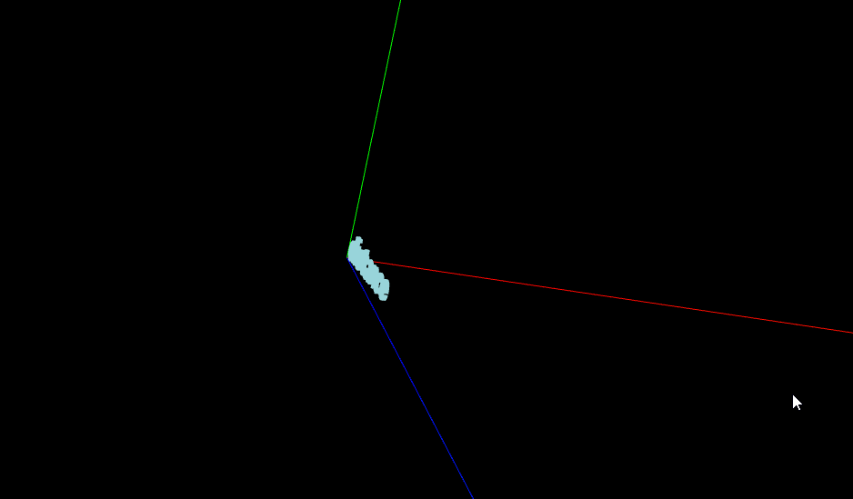

# 改变模型对象的旋转轴位置

1.平移几何体（一个网格对象对应一个几何体的情况）

```javascript
var box=new THREE.BoxGeometry(56,56,56);
// 平移几何体，改变旋转轴
box.translate ( 28, 0, 0 );

var mesh=new THREE.Mesh(box,material);
// 平移网格模型，不影响mesh自身的旋转轴
mesh.position.set(65,23,0)

// 立方体旋转动画效果
function render() {
    renderer.render(scene,camera);
    //每次绕y轴旋转0.01弧度
    // 不平移几何体，绕立方体的几何中心旋转
    // 平移距离是变长的一半，绕立方体侧边线旋转
    mesh.rotateY(0.1);
    requestAnimationFrame(render);
}
render();
```

2.嵌套父对象（一个网格包含多个几何体）

模型对象相对于父对象平移一定距离，然后旋转该模型的父对象

```javascript
// 加载mesh是外部加载得到模型对象
var box=new THREE.BoxGeometry(50,50,50);
var mesh=new THREE.Mesh(box,material);
// 平移几何体，改变旋转轴
//box.translate ( 28, 0, 0 ); 这个也可以

var group = new THREE.Group()
// group作为mesh的父对象
group.add(mesh)
// mesh相对父对象沿着x方向平移-25
mesh.position.x= -25

scene.add(group);


// 立方体旋转动画效果
function render() {
    renderer.render(scene,camera);
    group.rotateY(0.1);//旋转mesh的父对象
    requestAnimationFrame(render);
}
render();
```


字体几何体旋转是按照他的左下角的点来旋转的，规则几何体的旋转是按照他的几何中心旋转

