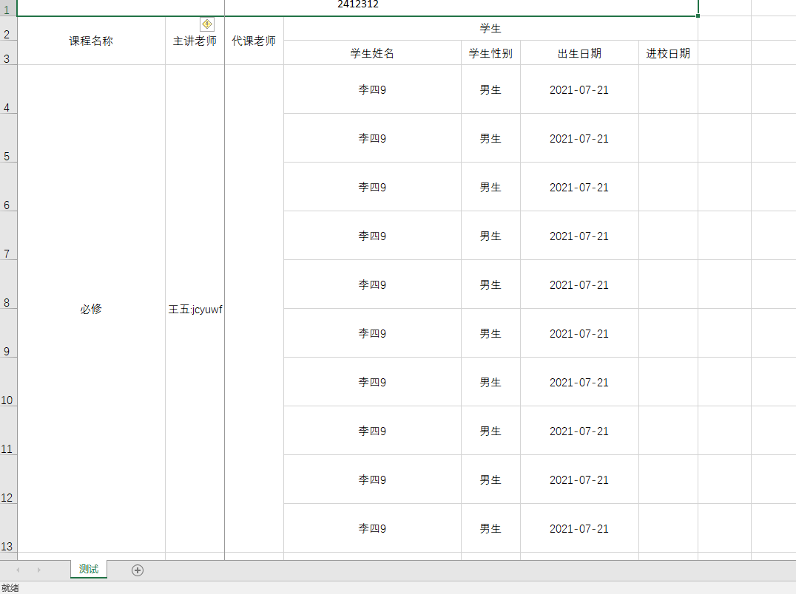

# 导入依赖

```xml
<easypoi.version>4.3.0</easypoi.version>
<dependency>
     <groupId>cn.afterturn</groupId>
     <artifactId>easypoi-base</artifactId>
     <version>${easypoi.version}</version>
     <exclusions>
         <exclusion>
             <groupId>org.apache.commons</groupId>
             <artifactId>commons-lang3</artifactId>
         </exclusion>
     </exclusions>
</dependency>
<dependency>
    <groupId>cn.afterturn</groupId>
    <artifactId>easypoi-web</artifactId>
    <version>4.3.0</version>
</dependency>
```

# 1.导出单一的数据（一个类）

实体类如下

```java
package com.wayn.filemanage.domain.vo;

import cn.afterturn.easypoi.excel.annotation.Excel;
import com.wayn.commom.constant.DOC_STATUS;
import com.wayn.commom.constant.DocCategory;
import lombok.Data;

import java.util.Date;

/**
 * 用于数据管理-勾图工作情况页面展示图纸任务的 View Object
 */
@Data
public class DocVo {
    // 勾图员信息
    @Excel(name = "人员编码")
    private String designerUsername;

    @Excel(name = "人员名称")
    private String designerName;
    /**
     * 勾图员所属二级部门
     */
    @Excel(name = "二级部门")
    private String designerSecondaryDept;
    /**
     * 勾图员所属三级部门
     */
    @Excel(name = "三级部门")
    private String designerTertiaryDept;

    @Excel(name = "小组名称")
    private String designerTeamName;

    @Excel(name = "项目名称")
    private String projectName;

    @Excel(name = "工作流名称")
    private String workflowName;

//    @Excel(name = "人员名称")
    private String workflowNumber;


    /**
     * 图纸类型，合同图/设计图/xxx
     */
    @Excel(name = "负责图纸类型")
    private String docCategory;

    @Excel(name = "负责图纸名称")
    private String docName;

    @Excel(name = "分配时间" ,format = "yyyy-MM-dd hh:mm:ss")
    private Date assignTime;

    @Excel(name = "确认时间",format = "yyyy-MM-dd hh:mm:ss")
    private Date confirmTime;

    @Excel(name = "完成状态")
    private String docStatus;

    @Excel(name = "工作量")
    private int workload;

    public void setDocCategory(int docCategory) {
        this.docCategory = DocCategory.parseString(docCategory);
    }

    public void setDocStatus(int docStatus) {
        this.docStatus = DOC_STATUS.parseStringForDocVo(docStatus);
    }
}
```

controller如下

```java
@Controller
@RequestMapping("/oa/dashboard")
public class DataOverviewController extends BaseController {
     @RequestMapping("downloadDrawingOverviewExcel")
    public void downloadDrawingOverviewExcel(ModelMap modelMap,HttpServletRequest request,HttpServletResponse response){
        List<DocVo> docVoList = docVoService.selectAll();// 获取数据
        ExportParams params = new ExportParams("勾图组工作情况详表", "1", ExcelType.XSSF);//excel表的标题
        modelMap.put(NormalExcelConstants.DATA_LIST, docVoList);//excel表的数据
        modelMap.put(NormalExcelConstants.CLASS, DocVo.class);//
        modelMap.put(NormalExcelConstants.PARAMS, params);
        modelMap.put(NormalExcelConstants.FILE_NAME, "构图小组数据");
        PoiBaseView.render(modelMap, request, response, NormalExcelConstants.EASYPOI_EXCEL_VIEW);
    }
}
```

# 2.一对多导出

课程类

```java
@Data
public class CourseEntity implements java.io.Serializable {
    private String id;
    
    @Excel(name = "课程名称", orderNum = "1", width = 25,needMerge = true)
    private String name;
    
    @ExcelEntity(id = "major")
    private TeacherEntity chineseTeacher;
    
    @ExcelEntity(id = "absent")
    private TeacherEntity mathTeacher;

    @ExcelCollection(name = "学生", orderNum = "4")
    private List<StudentEntity> students;

}
```

教师类

```java
@Data
public class TeacherEntity implements java.io.Serializable {
    private String id;
    
    @Excel(name = "主讲老师_major,代课老师_absent", orderNum = "1",needMerge = true,isImportField = "true_major,true_absent")
    private String name;

}
```

学生类

```java
@Data
public class StudentEntity implements java.io.Serializable {
    private String id;

    @Excel(name = "学生姓名", height = 20, width = 30, isImportField = "true_st")
    private String  name;

    @Excel(name = "学生性别", replace = { "男_1", "女_2" }, suffix = "生", isImportField = "true_st")
    private int sex;

    @Excel(name = "出生日期", databaseFormat = "yyyyMMddHHmmss", format = "yyyy-MM-dd", isImportField = "true_st", width = 20)
    private Date birthday;

    @Excel(name = "进校日期", databaseFormat = "yyyyMMddHHmmss", format = "yyyy-MM-dd")
    private Date registrationDate;

}
```

controller

```java
@Controller("myTest")
public class OneToMoreTest {
    // 一对多导出
    @GetMapping
    public void oneToMore(ModelMap map, HttpServletRequest request,HttpServletResponse response){
        // 准备数据
        CourseEntity courseEntity = new CourseEntity();
        courseEntity.setName("必修");
        courseEntity.setId("123");
        TeacherEntity teacherEntity = new TeacherEntity();
        teacherEntity.setId("1");
        teacherEntity.setName("王五:jcyuwf");
        courseEntity.setChineseTeacher(teacherEntity);
        List<StudentEntity> studentEntityList = new ArrayList<>();
        StudentEntity studentEntity = new StudentEntity();
        for (Integer i = 0; i<10;i++){
            studentEntity.setId(i.toString());
            studentEntity.setBirthday(new Date());
            studentEntity.setName("李四"+i);
            studentEntity.setSex(1);
            studentEntityList.add(studentEntity);
        }
        courseEntity.setStudents(studentEntityList);

        List<CourseEntity> courseEntityList = new ArrayList<>();
        courseEntityList.add(courseEntity);
        courseEntityList.add(courseEntity);

        // 导出数据
        ExportParams params = new ExportParams("2412312", "测试", ExcelType.XSSF);
        params.setFreezeCol(2);
        map.put(NormalExcelConstants.DATA_LIST, courseEntityList);
        map.put(NormalExcelConstants.CLASS, CourseEntity.class);
        map.put(NormalExcelConstants.PARAMS, params);
        PoiBaseView.render(map, request, response, NormalExcelConstants.EASYPOI_EXCEL_VIEW);
    }
}

```


导出结果



