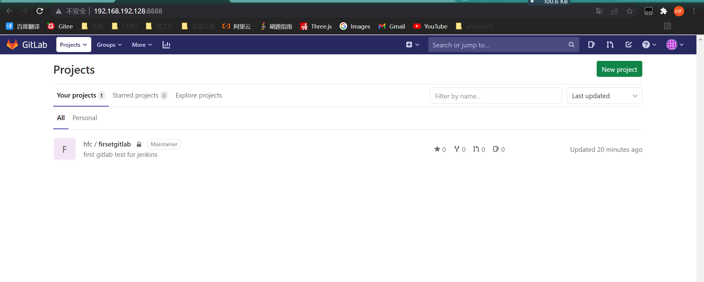
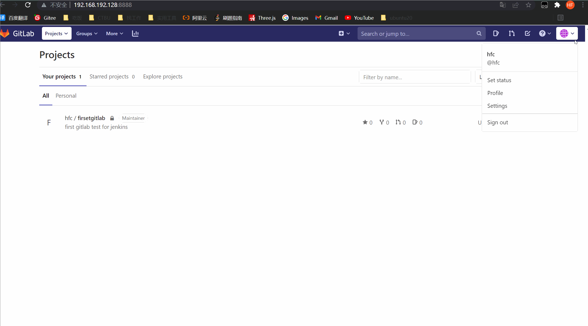

# ubuntu安装配置gitlab

### 1.更新apt源

```shell
apt update
```

### 2.先安装其他依赖

```shell
apt-get install curl openssh-server ca-certificates postfix   ## Postfix Configuration 选择 No configuration 就好
```

### 3.安装weget

```shell
apt-get install wget
```

### 4.下载gitlab-ce

```shell
wget https://mirrors.tuna.tsinghua.edu.cn/gitlab-ce/ubuntu/pool/focal/main/g/gitlab-ce/gitlab-ce_13.2.3-ce.0_amd64.deb

```

### 5.安装giltlab

```shell
dpkg -i gitlab-ce_13.2.3-ce.0_amd64.deb
```

### 6.修改url和端口

```shell
sudo vim /etc/gitlab/gitlab.rb
```

* 找到external_url "http://www.example.com"，修改为该服务器的地址，并配上端口号 

  ```rb
  external_url 'http://192.168.192.128:8888'  ## 本该服器的地址为192.168.192.128，端口号随便设置，不重复就ok
  ```

* 找到#nginx['listen_port']=nil, 去掉注释，修改端口为8888

  ```rb
  nginx['listen_port']=8888
  ```

### 7.配置gitlab

```shell
gitlab-ctl reconfigure  ## 此过程可能需要较长时间

```

### 8.重启gitlab

```she
gitlab-ctl restart

```

### 9.访问gitlab

​	在浏览器输入上面修改的地址与端口http://192.168.192.128:8888

​	第一次会输入登录密码，那是root账户的密码，我们可以通过root，和输入的密码进行登录

​	也可以注册账号密码，然后通过注册的账号密码登录

​	new project 新建一个项目



### 10.添加ssh

不添加ssh，无论你怎么git都会被拒绝



```text
curl -fsSL https://pkg.jenkins.io/debian-stable/jenkins.io.key | sudo tee \ /usr/share/keyrings/jenkins-keyring.asc > /dev/null
 
 
 
echo deb [signed-by=/usr/share/keyrings/jenkins-keyring.asc] \ https://pkg.jenkins.io/debian-stable binary/ | sudo tee \ /etc/apt/sources.list.d/jenkins.list > /dev/null
 
 
sudo apt-get update
 
 
sudo apt-get install jenkins
 
 
一共四条命令，保证每一条命令输入时在同一行。
```

