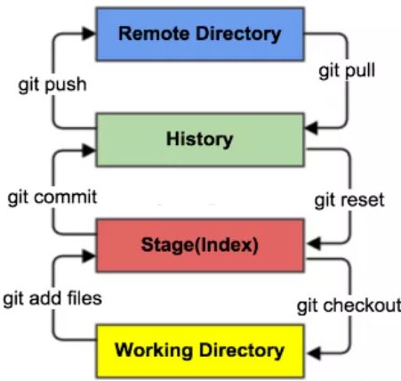
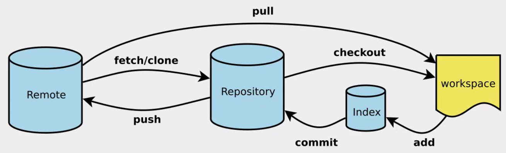
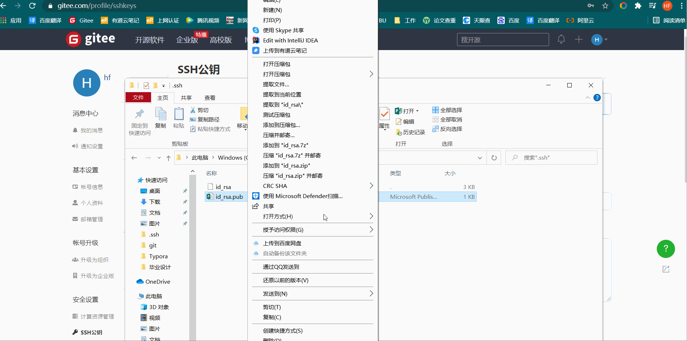

# 1. 安装git

## 	1.1 在Linux上安装Git    

[安装教程](https://www.runoob.com/git/git-install-setup.html)

​	输入 git 查看是否安装git

​	输入`sudo apt-get install git`    或者  `yum -y install git-core` 安装


## 	1.2 在windows上安装

可以用国内的镜像：https://npm.taobao.org/mirrors/git-for-windows、


# 2.Git配置

> **配置用户信息**（必须）
>
> 配置个人的用户名称和电子邮件地址：
>
> ```java
> $ git config --global user.name "runoob"
> $ git config --global user.email test@runoob.com
> ```


> **查看配置信息**
>
> ```lava
> $ git config --list
> http.postbuffer=2M
> user.name=runoob
> user.email=test@runoob.com
> ```


# 3.Git基本理论

> **三大区域**
>
> Git本地有三个工作区域：工作目录（Working Directory）、暂存区(Stage/Index)、资源库(Repository或Git Directory)。如果在加上远程的git仓库(Remote Directory)就可以分为四个工作区域。文件在这四个区域之间的转换关系如下：
>
> ****
>
> - Working Drectory：工作区，就是你平时存放项目代码的地方
> - Index / Stage：暂存区，用于临时存放你的改动，事实上它只是一个文件，保存即将提交到文件列表信息
> - Repository(History)：仓库区（或本地仓库），就是安全存放数据的位置，这里面有你提交到所有版本的数据。其中HEAD指向最新放入仓库的版本
> - Remote：远程仓库，托管代码的服务器，可以简单的认为是你项目组中的一台电脑用于远程数据交换


> **工作流程**
>
> １、在工作目录中添加、修改文件；
>
> ２、将需要进行版本管理的文件放入暂存区域；
>
> ３、将暂存区域的文件提交到git仓库。
>
> 因此，git管理的文件有三种状态：已修改（modified）,已暂存（staged）,已提交(committed)


# 4.项目搭建



## 

> **本地仓库搭建**
>
> ```java
> git init
> ```


> **克隆远程仓库**
>
> ```linux
> git clone https://gitee.com/hfcplus/biye.git
> ```


# 5.Git文件操作

> **文件的四种状态**
>
> * **Untracked**: 未跟踪, 此文件在文件夹中, 但并没有加入到git库, 不参与版本控制. 通过git add 状态变为Staged.
> * **Unmodify**: 文件已经入库, 未修改, 即版本库中的文件快照内容与文件夹中完全一致. 这种类型的文件有两种去处, 如果它被修改, 而变为Modified. 如果使用git rm移出版本库, 则成为Untracked文件
> * **Modified**: 文件已修改, 仅仅是修改, 并没有进行其他的操作. 这个文件也有两个去处, 通过git add可进入暂存staged状态, 使用git checkout 则丢弃修改过, 返回到unmodify状态, 这个git checkout即从库中取出文件, 覆盖当前修改 !
> * **Staged**: 暂存状态. 执行git commit则将修改同步到库中, 这时库中的文件和本地文件又变为一致, 文件为Unmodify状态. 执行git reset HEAD filename取消暂存, 文件状态为Modified


> **查看文件状态**
>
> ```java
> git status
> ```


> **忽略文件**
>
> 在主目录新建.gitignore文件
>
> ```java
> #为注释
> *.txt        #忽略所有 .txt结尾的文件,这样的话上传就不会被选中！
> !lib.txt     #但lib.txt除外
> /temp        #仅忽略项目根目录下的temp文件,不包括其它目录temp
> build/       #忽略build/目录下的所有文件
> doc/*.txt    #会忽略 doc/notes.txt 但不包括 doc/server/arch.txt
> ```


# 6.使用码云

> **1.设置本机绑定SSH公钥，实现免密码登录！**（免密码登录，这一步挺重要的，码云是远程仓库，我们是平时工作在本地仓库！)
>
> ```java
> #进入C:\Users\24321\.ssh目录，右键git bush here 
> #生成公钥 通过rsa加密公钥
> ssh-keygen -t rsa
> ```
>
> **2.将公钥id_rsa.pub添加到码云**
>
> 
>
> 3.创建新的仓库(什么东西都不要)
>
> 4.将新建的仓库克隆到本地
>
> 5.将克隆到本地文件全复制到项目里，这样项目就可以git了


# 7.Git分支


> 1. 查看所有本地分支
>
>    ```java
>    git branch
>    ```
>
> 2. 查看所有远程分支
>
>    ```java
>    git branch -r
>    ```
>
> 3. 新建分支并停留在原来的分支
>
>    ```java
>    git branch [branch-name]
>    ```
>
> 4. 新建分支并使用新分支
>
>    ```java
>    git checkout -b [branch]
>    ```
>
> 5. 切换分支
>
>    ```java
>    git checkout [branch]
>    ```
>
> 6. 合并指定分支到当前分支
>
>    ```java
>    git merge [branch]
>    ```
>
> 7. 删除本地分支
>
>    ```java
>    git branch -d [branch-name]
>    ```
>
> 8. 删除远程分支 sd
>
>    ```java
>    git push origin --delete [branch-name]
>    ```


> **分支提交遇见的问题**
>
> 1. 远程分支与本地分支未关联
>
>    ```java
>    fatal: The current(现在的) branch test2 has no upstream branch.
>    To push the current branch and set the remote(远程) as upstream, use
> <<<<<<< HEAD
>
> =======
> <<<<<<< HEAD
>
> =======
>
> >>>>>> dev
> >>>>>> 1722b941e1fc91d371f63ee25fe77cd043dc0927
>        git push --set-upstream origin test2
>    
>    ```
>
>    解决办法	
>
>    ```java
>     git push --set-upstream origin test2
>     git push -u origin test2  
>    ```
>
> 
>
> 2. 修改文件未提交直接切换分支
>
>    ```JAVA
>    error: Your local changes to the following files would be overwritten by checkout:
>    ```
>
>    解决办法
>
>    * 当修改的内容比较重要时
>
>      ```java
>      git add .
>      git commite -m "asdfasdf"
>      ```
>
>    * 当修改的内容不重要时
>
>      ```tex
>      git clean -n  //这个是清除文件预览
>      git clean -f //强制清除文件
>      ```
>
> 3. push产生冲突（conflict）
>
>    解决办法
>
>    * git pull 拉取项目  ，会提示那个文件产生冲突
>    * 进入该文件，修改冲突的地方
>
> 


# 8.基本操作

| 描述                                           | 操作                             |
| ---------------------------------------------- | -------------------------------- |
| 新建工作区                                     | git init    或者 git clone + url |
| 查看文件状态                                   | git status                       |
| 添加文件到暂存区（Stage/Index）                | git add .                        |
| 提交暂存区文件到本地仓库（Repository/History） | git commit -m "新建hello.txt"    |
| 添加文件到远程仓库（Remote）                   | git push                         |
|                                                |                                  |
|                                                |                                  |
|                                                |                                  |
|                                                |                                  |

# 9.撤回add

```git
git add * #将所有的文件提交到暂存区
git status # 查看提交到暂存区的文件
# 添加的文件出错，需要撤回
git reset HEAD #所有的文件全部撤回
git reset HEAD XXX/XXX/XXX.java
```


# 10.撤回修改commit

```git
git add * #提交所有改变新增的文件到暂存区
git commit -m "第一次提交"  #将暂存区的文件提交到history 本地仓库   HEAD指向它

#修改撤回的信息
git commit --amend

# 如果发现commit错误，需要撤销commit，不撤销add (不改变文件)
git reset --soft HEAD~1  # HEAD~1撤回上一次的提交，HEAD~2撤回两次的提交

# 撤销commit 和 add (不改变文件)
git reset --mixed HEAD~1 

# 删除工作空间改动代码，撤销commit，撤销git add . 
git reset --hard HEAD~1
```

# 11.撤回push

```git
git add .
git commit -m "第一次提交"
git push
# 回退版本
git reset --soft HEAD~1
#修改代码后
git add . 
git commit -m "还是第一次提交"
git push --force
```


# git submodule 

>

# clone别人的项目然后push到自己的仓库中

1. clone别人的项目

2. 创建一个空的仓库，不能有任何东西

3. 进入别人项目的目录中，git bansh here

   * ``git remote add origin https://github.com/hfcplus/test.git``

     >如果上面的语句出错：fatal: remote origin already exists
     >则：git remote rm origin
     >然后git remote add origin https://github.com/hfcplus/test.git

   * ``git branch -M main``

   * add, commit

   * ``git push -u origin main``

     

   

