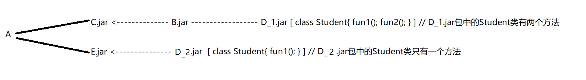
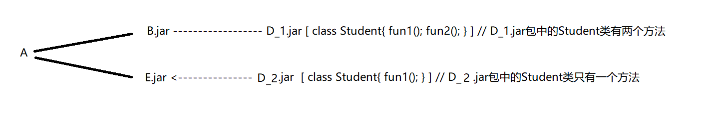

# 命令

在dos，或者idea中的Terminal中输入有的命令必须有 JAVA_HOME的环境变量，有些不需要(v, clean, validate)

在idea中的点点点不需要，我们一边用的最多的就是点点点，写这个就是为了应付面试

## 生命周期

|   命令   |                        解释                        |
| :------: | :------------------------------------------------: |
|  clean   |                        清除                        |
| validate |                检测pom是否正确完整                 |
| compile  |              编译，并且生成target文件              |
|   test   |  将test文件夹下的所有文件测试文件跑一遍，包含编译  |
| package  |             在target文件夹中生成jar包              |
|  verify  |  对集成测试的结果执行任何检查，以确保满足质量标准  |
| install  |        生成jar包，并且将jar包保存到本地仓库        |
|  deploy  | 最终的包复制到远程存储库以与其他开发人员和项目共享 |

## jar包冲突

### jar包冲突原因

>在同一工程中引用了版本不同的依赖，导致产生`java.lang.ClassNotFoundException`异常，`java.lang.NoSuchMethodError`异常，`java.lang.NoClassDefFoundError`异常，`java.lang.LinkageError`异常等；

### maven引入jar包规则

* 最短路径优先

  

  > 没有其他声明，工程A中的Student类只会是D_2.jar包中的Student

* 路径相同，使用工程pom文件中先声明的

  

  ```xml
  <dependencies>
      <dependency>
          <groupId>com.hfcplus</groupId>
          <artifactId>B</artifactId>
          <version>1.0</version>
      </dependency>
          <dependency>
          <groupId>com.hfcplus</groupId>
          <artifactId>E</artifactId>
          <version>1.0</version>
      </dependency>
  <dependencies>
  ```

  >因为B的声明在E的前面，所以会使用B中包含D_1.jar中的Student类

如上图所示，maven会引入D_1.jar,不会引入D_2.jar，当E.jar中有使用D_2.jar中新增加的class时，因为D_2.jar未引入，只引入D_1.jar，D_1.jar因为版本原因并没新类时，就会抛出`ClassNotFoundException`异常

## 解决方案

* 手动排除指定jar包

  

  ```xml
  <dependencies>
      <dependency>
          <groupId>com.hfcplus</groupId>
          <artifactId>C</artifactId>
          <version>1.0</version>
          <!-- 手动排除不需要的jar包 -->
          <exclusions>
              <exclusion>
                  <groupId>com.hfcplus</groupId>
                  <artifactId>D</artifactId>
              </exclusion>
          </exclusions>
      </dependency>
          <dependency>
          <groupId>com.hfcplus</groupId>
          <artifactId>E</artifactId>
          <version>1.0</version>
      </dependency>
  <dependencies>
  ```

  >手动排除D_1.jar,所有自会调用D_2.jar包中的Student类

# Maven 高级

## 继承

继承父项目的依赖，插件


## 聚合

clean，compile,package..... 父项目时，会根据父项目聚合子项目的顺序依次执行命名

## 多模块的最佳化

父项目的pom文件

```xml
<?xml version="1.0" encoding="UTF-8"?>
<project xmlns="http://maven.apache.org/POM/4.0.0"
         xmlns:xsi="http://www.w3.org/2001/XMLSchema-instance"
         xsi:schemaLocation="http://maven.apache.org/POM/4.0.0 http://maven.apache.org/xsd/maven-4.0.0.xsd">
    <modelVersion>4.0.0</modelVersion>

    <groupId>plus.hf</groupId>
    <artifactId>parent</artifactId>
    <packaging>pom</packaging>
    <version>1.0-SNAPSHOT</version>

    <!--聚合-->
    <modules>
        <!--子模板的相对路径-->
        <module>../son1</module>
        <module>../son2</module>
    </modules>

    <properties>
        <junit.version>4.13</junit.version>
        <mysql.version>8.0.29</mysql.version>
    </properties>

    <!--dependencyManagement管理依赖，只声明依赖-->
    <dependencyManagement>
        <dependencies>
            <dependency>
                <groupId>junit</groupId>
                <artifactId>junit</artifactId>
                <version>${junit.version}</version>
                <scope>test</scope>
            </dependency>

            <dependency>
                <groupId>mysql</groupId>
                <artifactId>mysql-connector-java</artifactId>
                <version>${mysql.version}</version>
            </dependency>
        </dependencies>
    </dependencyManagement>

</project>
```

子项目的pom文件:只引用自己想要的依赖

```xml
<?xml version="1.0" encoding="UTF-8"?>
<project xmlns="http://maven.apache.org/POM/4.0.0"
         xmlns:xsi="http://www.w3.org/2001/XMLSchema-instance"
         xsi:schemaLocation="http://maven.apache.org/POM/4.0.0 http://maven.apache.org/xsd/maven-4.0.0.xsd">
    <modelVersion>4.0.0</modelVersion>

    <groupId>plus.hf</groupId>
    <artifactId>son2</artifactId>
    <version>1.0-SNAPSHOT</version>
    <parent>
        <artifactId>parent</artifactId>
        <groupId>plus.hf</groupId>
        <version>1.0-SNAPSHOT</version>
        <relativePath>../parent/pom.xml</relativePath>
    </parent>

    <dependencies>
        <dependency>
            <groupId>mysql</groupId>
            <artifactId>mysql-connector-java</artifactId>
        </dependency>
    </dependencies>

</project>
```

dependencyManagement标签的作用就是子项目可以不引用父项目的所有依赖
