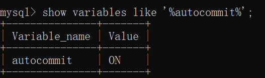

# 索引

```mysql
-- 查看索引
show index from table_name;

-- 添加索引
-- 1.添加PRIMARY KEY（主键索引）当设置该列为主键时，会自动添加主键索引
ALTER TABLE `table_name` ADD PRIMARY KEY ( `column` )

-- 2.添加UNIQUE(唯一索引)
ALTER TABLE `table_name` ADD UNIQUE (
`column`
)

-- 3.添加INDEX(普通索引)
ALTER TABLE `table_name` ADD INDEX index_name ( `column` )

-- 4.添加FULLTEXT(全文索引)
ALTER TABLE `table_name` ADD FULLTEXT ( `column`)

-- 5.添加多列索引
ALTER TABLE `table_name` ADD INDEX index_name ( `column1`, `column2`, `column3` )
```


# 时间函数

```mysql
-- 获取现在的时间
select now();  -- 2021-07-16 11:49:36

-- 获取现在的年月日
select current_date; -- 2021-07-16
select year(now());  
select month(now());
select day(now());

-- 获取现在的时分秒
select current_time;  -- 11:50:45

-- 将时间转换为天数
select to_days(now());  -- 738352

-- 获取时间的年月日
date(now());
DATE_FORMAT(now() ,'%Y-%m-%d')

```

# 存储引擎

| Engine             | Support | Comment                                                      | Transactions | XA   | Savepoints |
| ------------------ | ------- | ------------------------------------------------------------ | ------------ | ---- | ---------- |
| MyISAM             | YES     | MyISAM storage engine                                        | NO           | NO   | NO         |
| InnoDB             | DEFAULT | Supports transactions, row-level locking, and foreign keys   | YES          | YES  | YES        |
| MEMORY             | YES     | Hash based, stored in memory, useful for temporary tables    | NO           | NO   | NO         |
| CSV                | YES     | CSV storage engine                                           | NO           | NO   | NO         |
| FEDERATED          | NO      | Federated MySQL storage engine                               | NULL         | NULL | NULL       |
| PERFORMANCE_SCHEMA | YES     | Performance Schema                                           | NO           | NO   | NO         |
| MRG_MYISAM         | YES     | Collection of identical MyISAM tables                        | NO           | NO   | NO         |
| BLACKHOLE          | YES     | /dev/null storage engine (anything you write to it disappears) | NO           | NO   | NO         |
| ARCHIVE            | YES     | Archive storage engine                                       | NO           | NO   | NO         |

## **MyISAM存储引擎**

>
>
>MySQL中最常用的引擎
>
>特征：
>
>* 使用三个文件表示每个表
>  * 格式文件 — 存储表结构的定义（mytable.frm）
>  * 数据文件 — 存储表行的内容（mytable.MYD）
>  * 索引文件 — 存储表上索引（mytable.MYI）
>*  灵活的AUTO_INCREMENT字段处理
>*  可被转换为压缩、只读表来节省空间 

## **InnoDB存储引擎**

>
>
>MySQL中默认引擎
>
>特征：
>
>* 每个InnoDB表在数据库目录中以.frm格式文件表示
>* InnoDB表空间tablespace被用于存储表的内容
>* 提供一组用来记录事务性活动的日志文件
>* 用COMMIT(提交)、SAVEPOINT及ROLLBACK(回滚)**支持事务处理**
>*  提供全ACID兼容
>* 在MySQL服务器崩溃后提供自动恢复
>* 多版本（MVCC）和行级锁定
>* 支持外键及引用的完整性，包括级联删除和更新

## **MEMORY存储引擎**

>
>
>使用MEMORY存储引擎的表，其数据存储在内存中，且行的长度固定，这两个特点使得MEMORY存储引擎非常快。
>
>特征：
>
>*  在数据库目录内，每个表均以.frm格式的文件表示。
>* 表数据及索引被存储在内存中。
>* 表级锁机制。
>* 不能包含TEXT或BLOB字段。

### 选择引擎

*   MyISAM表最适合于大量的数据读而少量数据更新的混合操作。MyISAM表的另一种适用情形是使用压缩的只读表。
*  如果查询中包含较多的数据更新操作，应使用InnoDB。其行级锁机制和多版本的支持为数据读取和更新的混合操作提供了良好的并发机制。
* 可使用MEMORY存储引擎来存储非永久需要的数据，或者是能够从基于磁盘的表中重新生成的数据。

# 事务

## 特征

ACID

* A

  >原子性（Atomicity）
  >
  >整个事务中的所有操作，必须作为一个单元全部完成（或全部取消）

* C

  >一致性（Consistency）
  >
  >在事务开始之前与结束之后，数据库都保持一致状态

* I

  > 隔离性(Isolation)
  >
  >一个事务不会影响其他事务的运行。

* D

  >持久性(Durability)
  >
  >在事务完成以后，该事务对数据库所作的更改将持久地保存在数据库之中，并不会被回滚。

## 事务提交

默认为自动提交

* 单条DML语句将缺省地开始一个新的事务
* 失败自动回滚
* 成功自动提交
* 可以使用 START TRANSACTION 开启事务，这时的事务可以包含多条语句



不默认自动提交

* 想提交时用commit，想回滚用rollback

设置是自动提交

```mysql
SET AUTOCOMMIT = OFF； 
SET AUTOCOMMIT = ON； 
show variables like '%autocommit%'; -- 查看变量状态
```

## 事务回滚

只能回滚insert、delete和update语句，不能回滚select（回滚select没有任何意义）

对于create、drop、alter这些无法回滚

## 事务的隔离级别

当多个客户端并发地访问同一个表时，可能出现下面的一致性问题

* 脏读取（Dirty Read）

  >一个事务开始读取了某行数据，但是另外一个事务已经更新了此数据但没有能够及时提交，这就出现了脏读取

* 不可重复读（Non-repeatable Read）

  >原因：另一个事务进行了update或者delete
  >
  >在同一个事务中，同一个读操作对同一个数据的前后两次读取产生了不同的结果，这就是不可重复读。

* 幻像读（Phantom Read）

  >原因：另一个事务进行了insert
  >
  >幻像读是指在同一个事务中以前没有的行，由于其他事务的提交而出现的新行，但是这个事务又查询不到这个新行

### 隔离级别

* 读未提交（read uncommitted）

  > 允许一个事务可以看到其他事务未提交的修改。
  >
  > 如果这个事务读取了另一个事务未提交的数据，另一个事务发生回滚就会产生脏读

* 读已提交（read committed） 

  >允许一个事务只能看到其他事务已经提交的修改，未提交的修改是不可见的。
  >
  >不会产生脏读
  >
  >现在这个事务A进行查询，查询完毕，另一个事务B提交更新（update, delete）数据，事务A再一次查询，两次查询的结果不一致，这就是不可重复读

* 可重复读（repeated read） 

  >该隔离级别为InnoDB的缺省设置。InnoDB又是MySQL的默认引擎，所以也就是MySQL的默认隔离级别
  >
  >确保如果在一个事务中执行两次相同的SELECT语句，都能得到相同的结果，不管其他事务是否提交这些修改。
  >
  >事务A正在执行，事务B插入(insert)一条数据，因为该级别的隔离导致事务A查询的结果始终不变，所以当A重复插入这条数据时(如果设置了唯一约束)会失败，但是A又查不出重复的数据，这就是幻像读。
  >
  >但是Innodb解决了幻读的问题

* 串行化（serializable） 【序列化】

  >事务最高隔离级别，效率很低，不常使用
  >
  >将一个事务与其他事务完全地隔离。

# 三范式

## 第一范式

对属性的原子性

要求属性具有原子性，不可再分解；

学生（学号，姓名，性别，出生年月日）

## 第二范式

对记录的唯一性

每一行都要有唯一标识存在，这个唯一属性列被称为主关键字或主键、主码。实体的属性完全依赖于主关键字。

## 第三范式

对数据的冗余性

属性不依赖于其他非主属性。非主键字段不能传递依赖于主键字段


## 

