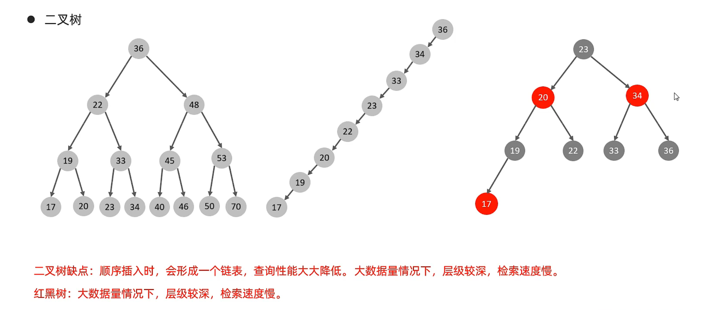
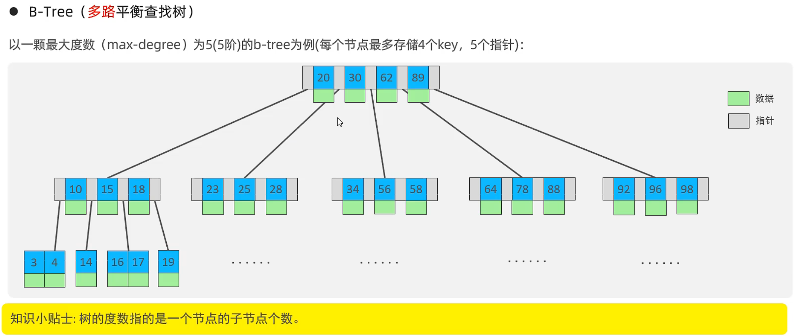
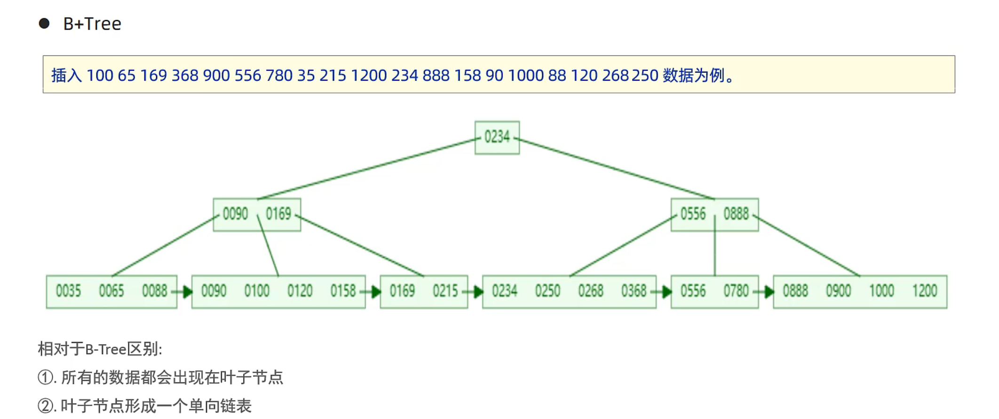
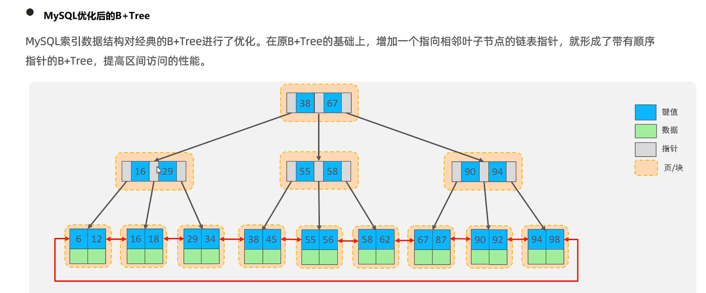
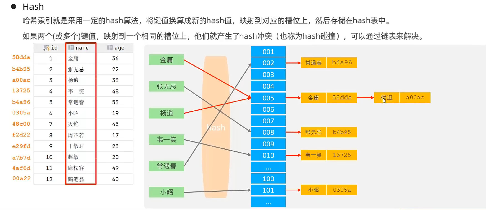

```mysql
create table user(
        id int primary key not null,
	name varchar(20),
	age int,
	sex int,
	id_num varcahr(32),
	key id_num (id_num)
)
```

## 索引优缺点

| 优点                                           | 缺点                             |
| ---------------------------------------------- | -------------------------------- |
| 提高数据检索效率，降低查询行数，减少IO成本     | 索引需要占空间                   |
| 索引是排序的，当数据需要排序时可以降低排序成本 | 表数据更新时会更新索引，加大负担 |


## 索引结构

根据索引结构的不同，有如下的索引

B+Tree索引：最常见的索引，大部分引擎都支持

Hash索引：效率高，但是只支持精确匹配（=，!=,in），不支持范围查询，不能排序

R-Tree索引（空间索引）：MyISAM引擎中一个特殊的索引，可以用于保存地理空间数据类型，通常使用的比较少

Full-text索引（全文索引）：可以快速匹配文档

| 索引          | innodb | MyISAM | Memory |
| ------------- | ------ | ------ | ------ |
| B+Tree索引    | 支持   | 支持   | 支持   |
| Hash          |        |        | 支持   |
| R-Tree索引    |        | 支持   |        |
| Full-text索引 | 支持   | 支持   |        |












### 为什么选择B+Tree做为索引结构

innodb的页是最小存储单元，大小为16k，页不仅存储数据（row）记录，还存储其他数据（文件头，页头，页目录，页尾，指针）


二叉树：当存储的数据按照数据大小依次储存时，会出现类似单链表的结构，层级很深

红黑树：能有效的降低二叉树的缺点，但是当数据量非常大时也会出现层级很深的情况

hash表：不能范围查找

B-Tree：父节点和叶子节点都会保存数据，导致每个父节点保存的键就变少，就会导致树的层级加大

B+Tree：父节点只保存键，父节点就能存储更多的键，有效控制树的高度。所有的数据都保存到叶子节点，查询就会稳定，因为每次都要到叶子节点才能找到数据。叶子节点是循环的双向链表，便于范围查询和排序。


## 索引类型
### 主键索引

一个表只能有一个主键，主键可以为单列，也可以为多列。单列和多列的每一列都不能为空，单列保证唯一，多列的组合保证唯一。

主键索引的叶子节点保存的时整行数据，在InnoDB中，主键索引也被称为聚簇索引

主键的好习惯

>不更新主键的值
>
>不重复使用主键列的值（当一行数据删除时，新增行时不能用原来旧的主键的值）
>
>不使用业务字段来当作主键：1.保密业务字段。2.可以更改业务字段的值

### 非主键索引

不是主键索引的索引，也称为二级索引，叶子节点保存的是主键的值

>```mysql
>select * from user where id = 1; -- 使用主键索引，通过id查询B+树
>select * from user where idnum = '500223199710028978'; -- 通过idnum的这个普通索引查找B+树，找到对应的id（主键的值），然后通过主键索引，查找B+树，从而获得数据。这个过程称为回表
>-- 基于非主键索引的查询需要多扫描一颗索引树，我们应当尽量的使用主键索引
>```

### 联合索引

由多个字段组成的索引，使用该索引时需要满足最左前缀原则

#### 左前缀原则

* 联合索引的最左N个字段，最左的必须出现

  > (a,b,c)组成的联合索引   where a = ？ b =？ 可以查询索引

* 字符串索引的最左M个字符。

  > (a)字符串字段为索引，where a like 'ssss%'  满足字符串索引的最左M个字符
  >
  > (a,b,c)其中a为字符串，where a like 'ssss%' and b = 2 满足字符串索引的最左M个字符，满足联合索引的最左N个字段

#### 建立联合索引原则

>* 考虑索引的复用能力。比如联合索引(a,b),因为支持最左前缀，所以a字段可以不建立索引，当a字段作为条件查询比较多的时候就可以把a字段提前。
>* 对于字段a,b当既有需要联合索引(a,b),又需要(a),(b)索引，这个时候就需要考虑空间。当b字段大于a字段时，联合索引可以设置为(b,a),然后再单独建立(a)的索引，节省空间


## 覆盖索引

二级索引保存的是主键的值，主键索引保存的是整行数据

当我们使用二级索引查找其他的字段时，我们是先通过二级索引查找到主键，在通过主键查找其他字段，这个就是回表

当我们用二级索引只查索引字段时，就不需要回表通过主键查找，这就是覆盖索引

索引覆盖可以减少树的搜索次数，提升查询性能。

```mysql
select * from user where idnum = '500223199710028978'; -- 通过idnum的这个普通索引查找B+树，找到对应的id（主键的值），然后通过主键索引，查找B+树，从而获得数据。这个过程称为回表
select idnum from user where idnum like '500223%';-- 只查询idnum，这个正好是普通索引字段，所以不需回表，这就是所以覆盖
```


## 索引失效

### or 前后字段都需要用到索引，否则索引失效

```sql
select * from user where id = 10 or addr = 'cq'; -- id 有索引，addr没索引，索引失效
```


### 联合索引不满足最左前缀，索引失效

最左前缀：联合索引的最左的列必须使用到，字符串也必须满足最左前缀(like 'asdfa%')

```mysql
create index idx_user_name_phone_age on user('name', 'phone', 'age'); -- 在user表的name，phone，age建立联合索引
select * from user where name = 'zs' and phone = '13452954500' and age =15; -- 会使用到所有索引（name， phone， age）
select * from user where name = 'zs' and phone = '13452954500' ; -- 会使用到部分索引（name， phone）
select * from user where name = 'zs' and age = 15 ; -- 会使用到部分索引（name）
select * from user where phone = '13452954500' and age = 15 ; -- 索引失效
select * from user where phone = '13452954500' and age = 15 and name = 'zs'; -- 会使用到所有索引（name， phone， age）
```

### 索引的列进行计算，索引失效

```mysql
create index idx_user_age on user('age'); -- 在user表的age建立索引
select * from user where age = 15 ; -- 会使用到索引 age
select * from user where age + 10 = 25 ; -- 不会使用到索引 age
```

### 索引的列使用范围查询(<,>)，索引失效

```mysql
create index idx_user_age on user('age'); -- 在user表的age建立索引
select * from user where age > 15 ; -- 索引失效
select * from user where age >= 15 ; -- 索引有效
```

### 字符串不加单引号，索引失效

```mysql
create index idx_user_phone on user('phone'); -- 在user表的phone建立索引
select * from user where phone = '13452954500' ; -- 索引有效
select * from user where  phone = 13452954500 ; -- 索引失效
```


### 隐式转换可能导致索引失效

隐式转换规则

>1. 两个参数至少有一个是`NULL`时，比较的结果也是`NULL`，特殊的情况是使用`<=>`对两个`NULL`做比较时会返回`1`，这两种情况都不需要做类型转换
>
>   ```mysql
>   select 23 + null; -- null
>   ```
>
>2. 两个参数都是字符串，会按照字符串来比较，不做类型转换
>
>3. 两个参数都是整数，按照整数来比较，不做类型转换
>
>4. 十六进制的值和非数字做比较时，会被当做二进制串
>
>5. 有一个参数是`TIMESTAMP`或`DATETIME`，并且另外一个参数是常量，常量会被转换为`timestamp`
>
>6. 有一个参数是`decimal`类型，如果另外一个参数是`decimal`或者整数，会将整数转换为`decimal`后进行比较，如果另外一个参数是浮点数，则会把`decimal`转换为浮点数进行比较
>
>7. **所有其他情况下，两个参数都会被转换为浮点数再进行比较**
>
>   ```mysql
>   select 1000 + '123';	-- 1123
>   select 1000 + 'a123';	-- 1000
>   select 1000 + '1@';		-- 1001
>   select 1000 + '1.23adf';-- 1001.23
>   ```
>
>   

字符串转浮点数规则

>1. **不以数字开头**的字符串都将转换为`0`。如`'abc'`、`'a123bc'`、`'abc123'`都会转化为`0`；
>2. **以数字开头的**字符串转换时会进行截取，从第一个字符截取到第一个非数字内容为止。比如`'123abc'`会转换为`123`，`'012abc'`会转换为`012`也就是`12`，`'5.3a66b78c'`会转换为`5.3`，其他同理。

```mysql

```

