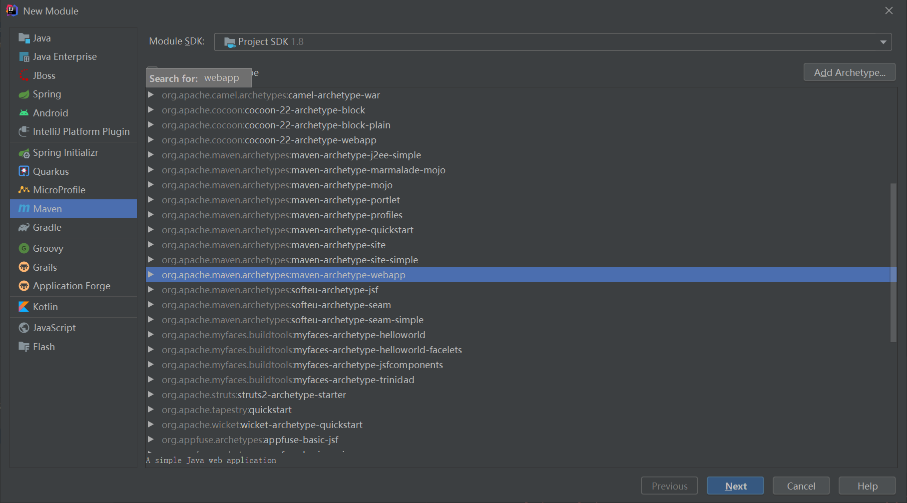
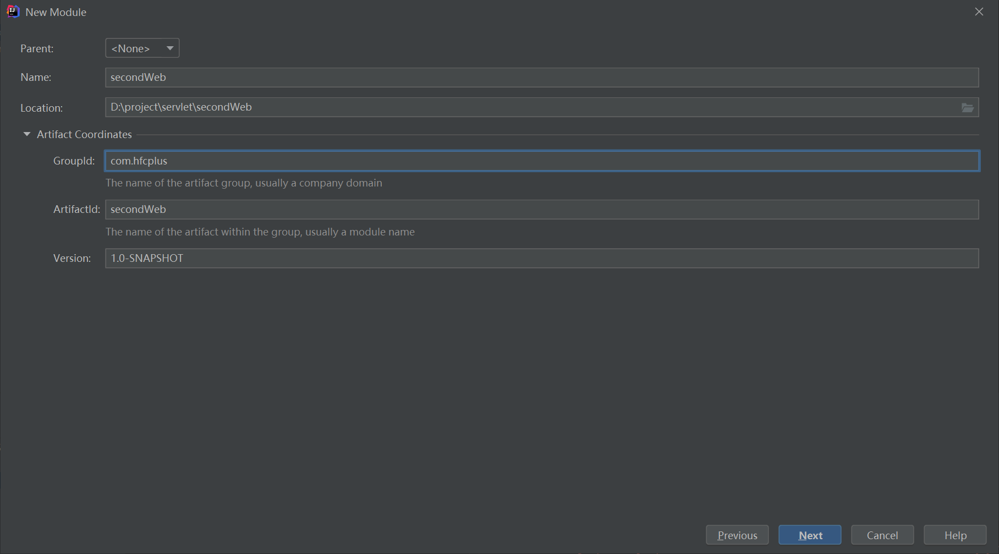
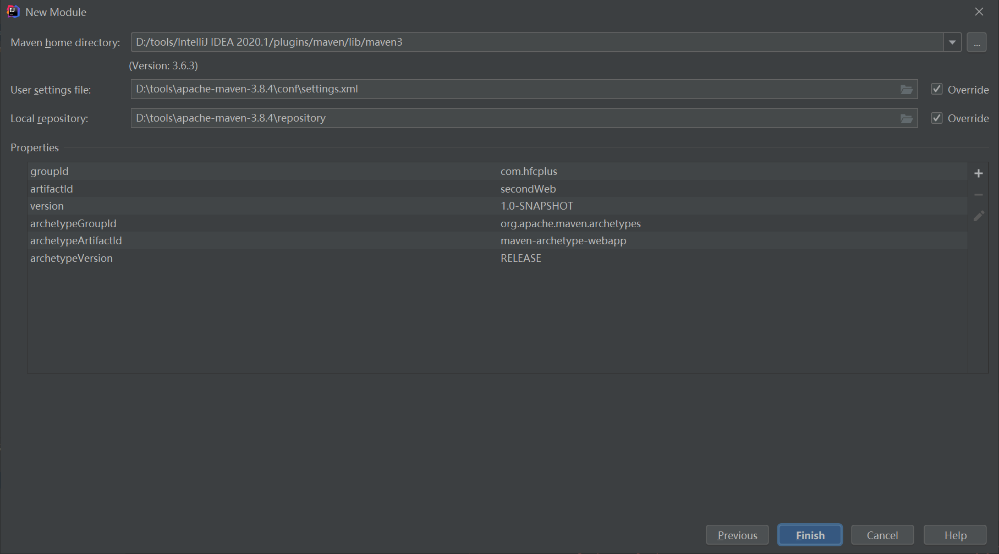
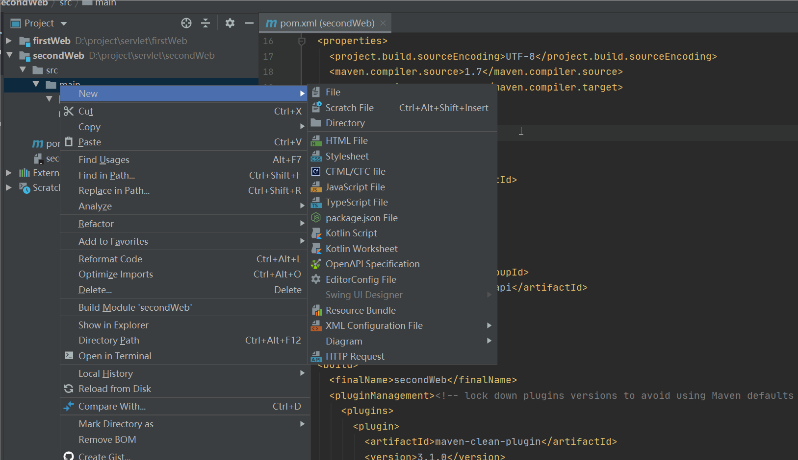
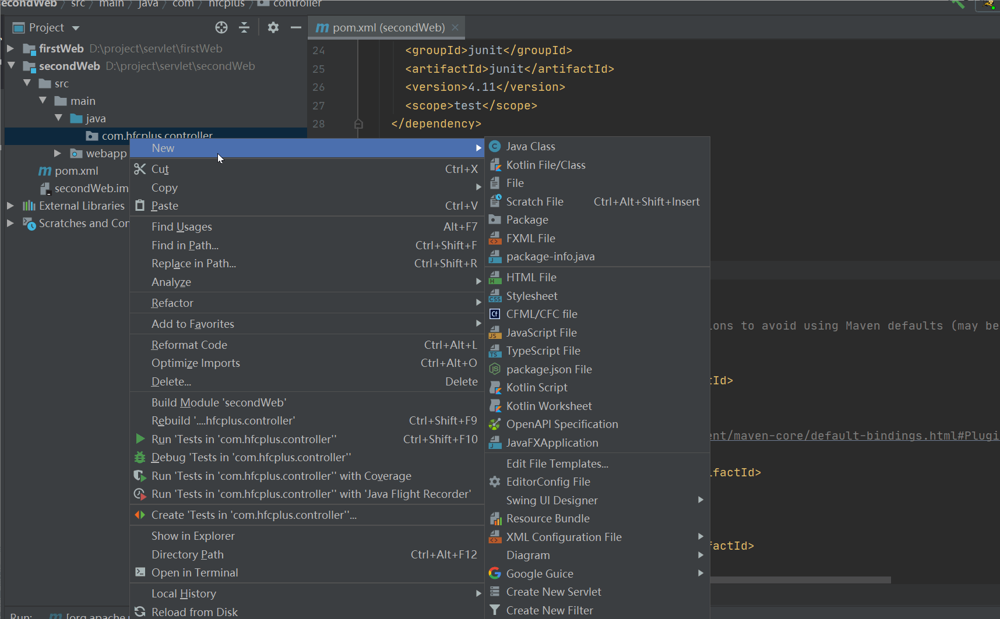

# 新建servlet项目

1. 新建空的project

2. 新建Maven module，选择maven-archetype-webapp

   

   

   

   

   

3.  引入依赖

   ```xm
   <dependency>
   <groupId>javax.servlet</groupId>
   <artifactId>javax.servlet-api</artifactId>
   <version>4.0.1</version>
   </dependency>
   ```

4. 新建servlet

   * 新建java文件夹

     

   * 新建servlet文件

     

​		

# 重定向与转发

## 重定向

response.sendRedirect("url或者uri");

>1. 浏览器第一次发送请求，服务端返回302，和location
>
>2. 浏览器根据location重新发送请求
>3. 如果服务端继续重定向则重复1~2

>重定向浏览器最少发送两次请求，判断是否为重定向：看服务端第一次返回的状http态是否为302
>
>重定向时只能get请求

## 转发

request.getRequestDispatcher("uri")

>1. 浏览器只发送一次请求，

aaba

2451

aacb