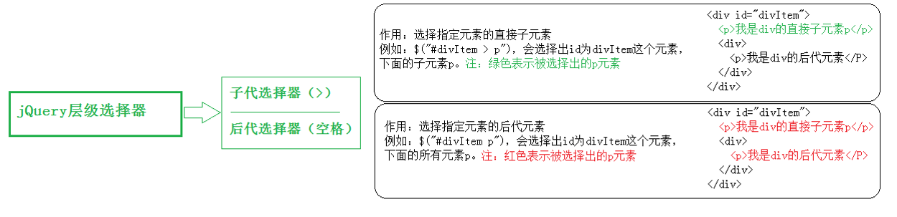

## jQuery 的入口函数和 `$` 符号

原生 js 的入口函数指的是：`window.onload = function() {};` 如下：

```javascript
        //原生 js 的入口函数。页面上所有内容加载完毕，才执行。
        //不仅要等文本加载完毕，而且要等图片也要加载完毕，才执行函数。
       window.onload = function () {
           alert(1);
       }
```

而 jQuery的入口函数，有以下几种写法：

写法一：


```javascript
       //1.文档加载完毕，图片不加载的时候，就可以执行这个函数。
       $(document).ready(function () {
           alert(1);
       })
```

写法二：（写法一的简洁版）

```javascript
       //2.文档加载完毕，图片不加载的时候，就可以执行这个函数。
       $(function () {
           alert(1);
       });
```

写法三：

```javascript
       //3.文档加载完毕，图片也加载完毕的时候，在执行这个函数。
       $(window).ready(function () {
           alert(1);
       })
```

**jQuery入口函数与js入口函数的区别**：

区别一：书写个数不同：

- Js 的入口函数只能出现一次，出现多次会存在事件覆盖的问题。

- jQuery 的入口函数，可以出现任意多次，并不存在事件覆盖问题。


区别二：执行时机不同：

- Js的入口函数是在**所有的文件资源加载**完成后，才执行。这些**文件资源**包括：页面文档、外部的js文件、外部的css文件、图片等。

- jQuery的入口函数，是在文档加载完成后，就执行。文档加载完成指的是：DOM树加载完成后，就可以操作DOM了，不用等到所有的**外部资源**都加载完成。

文档加载的顺序：从上往下，边解析边执行。

# 选择器

### 基本选择器


### 层级选择器




### 基本过滤器


### 属性选择器


### 筛选选择器

