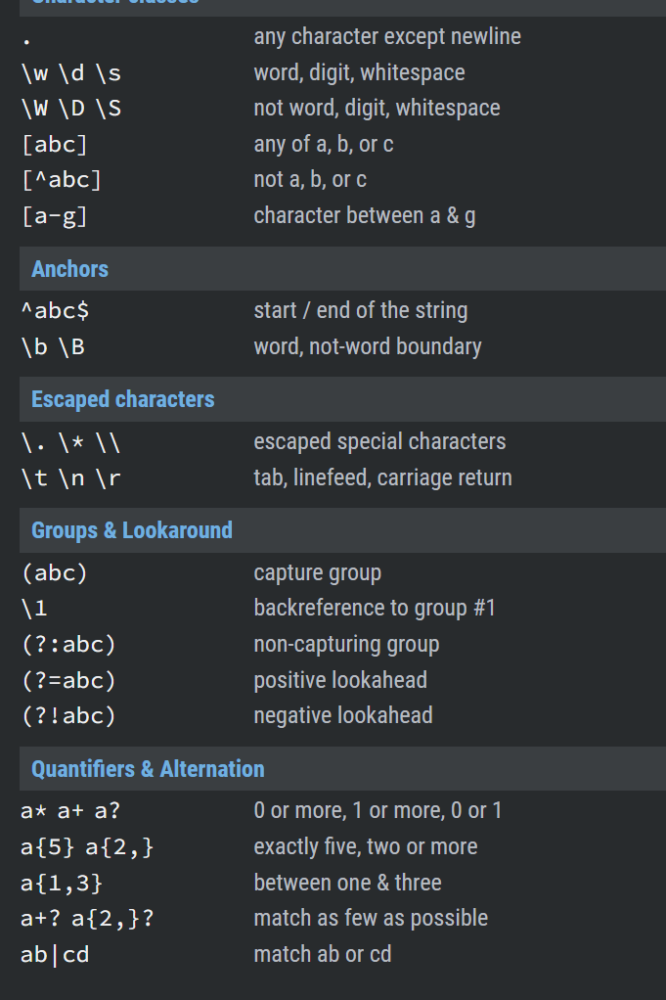

在javascript中使用正则表达式

# 创建正则表达式

## 使用构造函数创建正则表达式的对象

```javascript
var 变量 = new RegExp("正则表达式"); // 注意，参数是字符串

var 变量 = new RegExp("正则表达式", "匹配模式"); // 注意，两个参数都是字符串
```

只传一个参数

```javascript
var reg = new RegExp("a"); // 定义一个正则表达式：检查一个字符串中是否含有 a

var str1 = "qianguyihao";
var str2 = "smyh";

// 通过 test()方法，判断字符串是否符合 上面定义的 reg 规则
console.log(reg.test(str1)); // 打印结果：true
console.log(reg.test(str2)); // 打印结果：false
```

传两个参数时 （匹配模式，第二个参数为匹配模式 i,g）

* `i` 忽略大小写。这里的 i 指的是 ignore。
* `g` 全局匹配模式。这里的 g 指的是 global。

```javascript
var reg = new RegExp('A', 'i');
var str = 'qiangu';

console.log(reg.test(str)); // 打印结果：true
```

## 使用字面量创建正则表达式

```javascript
var 变量 = /正则表达式/;  // 注意，这个语法里没有引号

var 变量 = /正则表达式/匹配模式;  // 注意，这个语法里没有引号
```

# 正则表达式的简单语法

检查一个字符串中是否包含 a或b

```javascript
	var reg = /a|b/;

	var reg = /[ab]/;  // 跟上面的那行语法，是等价的
```

[]表示：或

- `/[ab]/` 等价于 `/a|b/`：检查一个字符串中是否包含 **a或b**
- `/[a-z]/`：检查一个字符串那种是否包含**任意小写字母**
- `/[A-Z]/`：任意大写字母
- `/[A-z]/`：任意字母
- `/[0-9]/`：任意数字
- `/a[bde]c/`：检查一个字符串中是否包含 abc 或 adc 或 aec

[^ ] 表示：除了

```javascript
  var reg = /[^ab]/; // 规则：字符串中，除了a、b之外，还有没有其他的字符内容？
  var str = "acb";

  console.log(reg.test(str)); // 打印结果：true
```

```javascript
	var reg = /[^0-9]/;  // 规则：字符串中，除了数字之外，还有没有其他的内容？
	var str1 = "1991";
	var str2 = "199a1";

	console.log(reg.test(str1)); // 打印结果：false （如果字符串是 纯数字，则返回 false）
	console.log(reg.test(str2)); // 打印结果：true
```


