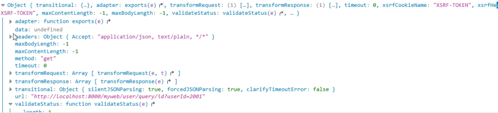

## 使用方式

npm

```cmd
npm install axios
```

cdn

```javascript
<script src="https://unpkg.com/axios/dist/axios.min.js"></script>
```

本地文件

```javascript
<script src="js/axios.min.js"></script>
```


## get请求

在url中传参

```javascript
function fun() {
    let url = "http://localhost:8080/student?id=1000";
    axios.get(url).then(rep=>{
        console.log("成功")
    }).catch(err=>{
        console.log("失败")
    }).finally(fin=>{
        console.log("总是执行")
    })
}
```

通过params传参

```javascript
function fun() {
    let url = "http://localhost:8080/student";
    axios.get(url,{
        params:{
            userId: 1000,
            name: "lisi"
        }
    }).then(res=>{
        console.log("成功")
        console.log(res.data)
    })
}
```

## post请求

### 通过字符串传参

```javascript
function fun() {
    let url = "http://localhost:8080/student";
    axios.post(url,"userId=1001&name=lisi").then(rep=>{
        console.log("成功")
    }).catch(err=>{
        console.log("失败")
    }).finally(fin=>{
        console.log("总是执行")
    })
}
```

### 传递json

前端

```javascript
function fun() {
    let url = "http://localhost:8080/student";
    axios.post(url,{        
        userId: 1001,
        name: "lisi",
        age: 25
    }).then(rep=>{
        console.log("成功")
    }).catch(err=>{
        console.log("失败")
    }).finally(fin=>{
        console.log("总是执行")
    })
}
```

后端接收json

* 必须是对象接收
* 接收参数前加@RequestBody，从请求体中获取数据

```java
@PostMapping("student")
public Student getStudent(@RequestBody Student student) {
    System.out.println(student);
}
```

### 使用配置对象

```javascript
function fun() {
    let url="";
    axios({
        url: url,
        method: "post",
        data: {
            id: 1001,
            name: "lisi",
            age: 80
        }
    }).then(res=>{
        console.log("成功")
    })
}
```

## 拦截器

config是请求对象，包含了url，method，data，请求头等等



请求拦截器

```javascript
axios.interceptors.request.use(function(config){
    // config
    config.url = config.url + "&sex=男";
    return config;
},function(err){
})
```

应答拦截器（可以设置统一处理错误）

```javascript
axios.interceptors.response.use(function(resp){
    // resp 包含了返回的data，status
    return resp;
},function(err){
})
```

